# File based system VS Database system

## File based system

### Delimited files VS Fixed width files

::: {.columns .ragged columngap=1em}

```
Name, Age, Salary
Alice, 25, 50000
Bob, 30, 60000
```

\columnbreak

Delimited files are files where the data is separated by a delimiter like comma, tab, etc.

:::

---

::: {.columns .ragged columngap=1em}

```
Name    Age    Salary
Alice   25     50000
Bob     30     60000
```

\columnbreak

Fixed width files are files where the data is separated by a fixed width.

:::

### Problems with file based system

Some of the problems with file based system are:

1. Data redundancy (data is repeated) which can lead to disk and memory wastage.
2. No data sharing (changes is not shared between different team members) there is no centralized data storage. On database systems, data is stored on a central remote database server which is accessible by different team members.
3. Linear/Sequential search (searching for data is slow $O(n)$). Solved using indexing in database systems.
4. No constraints (no way to enforce constraints like lowest age, etc).
5. No standardization (for example each user can have their own delimiter).
6. Program data dependence (Programs are dependent on the data format, for example if we change the delimiter in file we should change it in the program). In actual database systems, programs are dependent on the metadata (data about data for example column names, data types, etc.) and not the data itself.
7. No security or permissions (anyone can access the data). Security has two main concepts: authentication and authorization.
   1. Authentication: Who are you?
   2. Authorization: What can you do (permissions/roles) (for example a customer in an e-commerce website can't add products).
   <!-- The video also explains what is the alternative in actual DBMS  -->
8. Manual Backup. In database systems, backups are done automatically based on a _Job_ with a _Schedule_.
9. No relationships which can lead to data inconsistency (for example, if a user is deleted, all the orders of that user should also be deleted).

## Database system

Database is a collection of objects, those objects can be tables, views, functions, etc. The tables are related to each other.

Database is the backbone of any software application. It's a collection of related objects/data that are stored in a structured way and related to each other.

### Database design should:

1. Meet business requirements. To meet business requirements, we should not have un-required data redundancy, or NULL values unless it's necessary/justified.
2. Have consistent data and no data redundancy.
3. Maintainable and can meet business changes. Bad DB design makes it hard or even impossible to make changes.

### Database types:

1. Relational/SQL databases (SQL databases like MySQL, PostgreSQL, etc).
2. Non-Relational/NoSQL databases (like MongoDB).
3. In-memory databases (like Redis).
4. Cloud databases (like AWS RDS, Google Cloud SQL, etc).

Traditional DB is stored in a hard disk, and loaded into RAM when needed, but in-memory databases are usually cached in RAM which makes them faster.

### Advantages of database systems:

1. standardization as each DB consist of a collection of schemas and each schema consists of a collection of objects and the most popular type of these objects are tables. and Better data accessibility using SQL (Structured Query Language), as we use metadata to access data not the data itself.
2. Data Sharing as data is shared between different team members and different members can access different parts of the data based on their roles.
3. Has constraints like enforcing integrity constraints (for example, lowest age, minimum salary, etc) to meet business requirements.
4. Restricting unauthorized access. Each user can access only the data they are authorized to access.
5. Provides backup and recovery. Backups are done automatically based on a Job with a Schedule.
6. Minimal data redundancy by using a column that is unique for each row (Primary Key), so no entry with the same value for that column can be inserted (all values can be the same except for that column value). Minimizing data redundancy leads to data integrity and consistency. Sometimes there is justified data redundancy (for example two employee with the same name) and justified NULLs (for example there a manager for each employee, in the company but with the CEO that field is NULL).
7. Program data independence. Programs are dependent on the metadata and not the data itself. SQL code is written against the metadata and not the data itself.

### Challenges with database systems:

1. Needs expertise to use
2. DBMS (Database Management System) are expensive as it sometimes needs a license
3. DBMS may be incompatible with other DBMS, for example a DB built with MySQL can't be used with SQLServer and vice versa so to convert a MySQL DB to SQLServer we first need to convert the tables of the DB to XML and the XML data can be imported to SQLServer.
   1. XML (Extensible Markup Language) is a markup language just like HTML but it's used to store data. Some mobile applications use XML to store small amounts of data as it's faster than a DB.
   2. XML is also used to create designs of websites and mobile applications.
   3. Before RESTful API architecture, XML was used in responses another architecture called SOAP (Simple Object Access Protocol), so instead of returning JSON, the API returns XML.
   4. In old DotNet framework, XML was used to store configurations of the application. Now with DotNet Core, JSON is used instead of XML.
4. API response can be in XML or JSON format.

### Database Life Cycle

Analysis $\rightarrow$ System Analyst
Requirement Document

Database Design $\rightarrow$ Database Designer
Entity Relationship Diagram (ERD) is a logical representation of the database. It shows the relationships between the tables.

Database Mapping $\rightarrow$ Database Designer
Database Schema

Database Implementation $\rightarrow$ Database Developer
Using DBMS (SQL Server) To Create The Database

Application $\rightarrow$ Application Programmer
Web - Desktop - Mobile

Client $\rightarrow$ End User
Use Database Indirectly Through The Application

All things related too database is the responsibility of the backend developer, unless the company is big enough to have a separate database team.

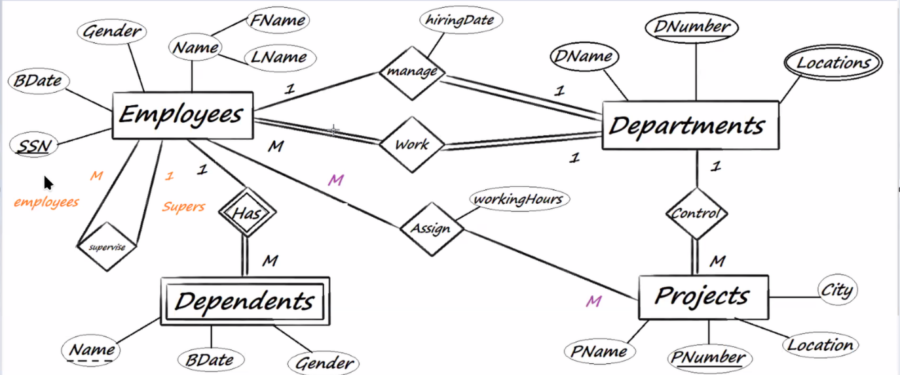{width=500px}

In database mapping phase we aim to have a database schema without NULLs or duplicate data.

### Database Users & Roles

- Database Administrator (DBA)
- System Analyst
- Database Designer
- Database Developer
- Application Programmer
- BI & BigData Specialist (Data Scientist)
- End User

### Database Design Phase

As a backend developer, in this phase you should convert the SRS into an ERD. The ERD is a logical initial design

#### ERD

Contents of ER Model:

- Entities - person, place, object, event, concept (often corresponds to a real time object that is distinguishable from any other object)
- Attributes - property or characteristic of an entity type (often corresponds to a field in a table)
- Relationships - link between entities (corresponds to primary key-foreign key equivalencies in related tables)

::: {.columns .ragged columngap=0em}

What each shape represents:

- Rectangles: entity sets
- Diamonds: relationship sets
- Ellipses: attributes

\columnbreak

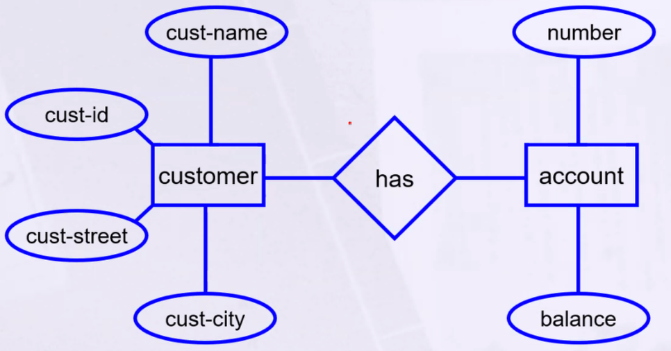
:::

The ERD is used later to create the database schema.

There is no one way to create an ERD. Two developers can create two different ERDs for the same project, and both can be correct.

##### Strong VS Weak Entities

- Strong entities: Exist independently of other entities. (For example, a user)
- Weak entities: Exist only in relation to a strong entity. (For example, an order which can't exist without a user)

Whether an entity is strong or weak depends on the business requirements.

In ERD weak entities are represented by a double rectangle, while strong entities are represented by a single rectangle.

<!-- Identifying relationship is represented by a diamond. -->

In the example below if there is no account, the transaction can't exist, so account is a strong entity and transaction is a weak entity.

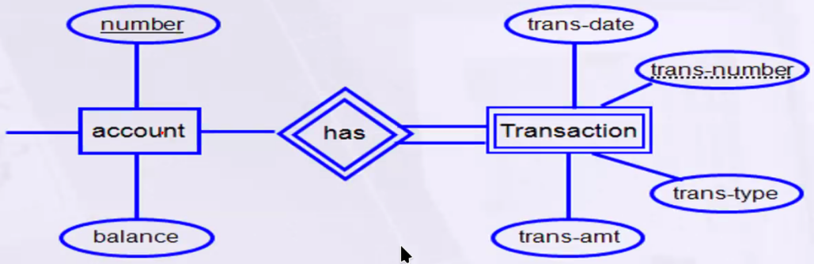{width=450px}

#### Types of Attributes

1. Simple: Atomic values (For example, age)
   - Simple attributes are represented by an ellipse in the ERD.
2. Composite: Can be divided into smaller parts (For example, `Name` consists of `fName`, `lName`)
   - Composite attributes are represented by an ellipse that have smaller ellipses getting out of it.
3. Derived: Derived from other attributes (For example, age can be derived from Date of Birth)
   - Derived attributes are not stored in the database, they are calculated on the fly. But that is not always the case, sometimes they are stored in the database, if that calculation is complex.
   - Derived attributes are represented by a dashed ellipse in the ERD.
4. Multi-valued: Can have multiple values (For example, phone number)
   - Multi-valued attributes are represented by a double ellipse in the ERD.
5. Complex (Composite & Multi-valued): Can be divided into smaller parts and can have multiple values
   - Complex attributes are represented by a double ellipse that have smaller ellipses getting out of it.

#### Relationships

A Relationship is an association among several entities. A relationship may also have attributes. It's represented by a diamond in the ERD.

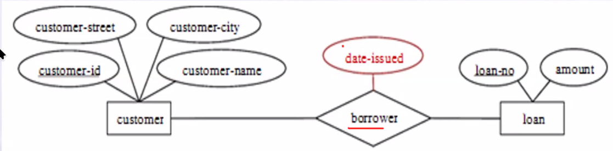{width=450px}

For example, consider the entity sets customer and loan and the relationship set borrower. We could associate the attribute date-issued to that relationship to specify the date when the loan was issued.

**Degree of relationships:**

- Unary: between two instances of one entity type
  - Manager which is an `Employee` manages other `Employee`
- Binary: between the instances of two entity types
  - `Employee` works in a `Department`
- Ternary: among the instances of three entity types
  - `Provider` provides `Service` to `Customer`

{width=450px}

**Cardinality Constraints:**

- One to one (1:1)
  - One `Employee` has one `Car`
- One to many (1:M)
  - One `Department` has many `Employee`
- Many to one (M:1)
  - Many `Employee` work in one `Department`
- Many to many (M:N)
  - Many `Student` enroll in many `Course`

We choose the highest cardinality constraint for the relationship. For example, if an `Employee` can work in one `Department`, but a `Department` can have many `Employee`, then the relationship is one to many.

**Participation Constraints:**

- Total participation: **Every** entity in the entity set must participate in at least one relationship in the relationship set.
  - Every `Employee` must be in a `Department`
  - Used with words like: Must, Mandatory, Each and Every, etc.
- Partial participation: **Some** entities may not participate in any relationship in the relationship set.
  - Some `Employee` may have a `Car`
  - Used with words like: Optional, May, Some, Zero or More, etc.

\begin{box3}{Important Note:}

In a Binary relationship with many to many cardinality, we don't need to specify the participation.

\tcblower

In a Ternary relationship, we don't need to specify the cardinality, nor the participation.

\end{box3}

### Primary Key

Primary key is a unique identifier for each row in a table. It's a column that is unique and not null for each row. It's represented by an underline in the ERD.

::: {.columns .ragged columngap=1em }

For example an `Employee` can have those attributes:

Here we can have either `SSN` or `Code` as a primary key, as both are unique for each `Employee`.

\columnbreak

{width=70%}

:::

- Primary Key: Chosen key to uniquely identify a row in a table.
- Candidate Key: A column that can be a primary key. which is both `SSN` and `Code` in this case.
- Alternate Key: A column that can be a primary key but is not the primary key. which is the other column that is not the primary key.
- Partial Key, Composite Key, Foreign Key: Will be discussed later.
- **_Super Key_**: Self Study

**_Review Symbols Part_**

\pagebreak

# Case Study

**Steps To Make ERD:**

Read Documentation 2 Times:

1. Get Entities & Attributes
2. Get Relationships (Degree - Cardinality - Participations)

- With Ternary Don't Look At Cardinality & Participations
- With Binary & M-M Don't Look At Participations
- Weak Entity Always Total Participations

> Note: If you have a problem ask the mentor. He is free from 5:00 PM to 10:00 PM.

## Problem Statement:

A big company has decided to store information about its projects and employees in a database. The company has wisely chosen to hire you as a database designer. Prepare an E-R diagram for this Company according to The following Description:

- The company has a number of employees. Each `employee` has `SSN`, `Birth Date`, `Gender` and `Name` which are represented as `Fname` and `Lname`.
- The company has a set of departments each department has a set of attributes `DName`, `DNUM` (unique) and locations.
- Employees work in several projects each project has `Pname`, `PNumber` as an identifier, Location and City.
- Each employee may have a set of dependent; each dependent has Dependent Name (unique), Gender, and Birth Date.
  - Note: if the employee left the company no needs to store his dependents info
- For each Department, there is always one employee assigned to manage that Department and each manager has a hiring Date
- Department may have employees but employee must work on Only One department
- Each department may have a set of projects and each project must assigned to one department
- Employees work in several projects and each project has several employees and each employee has a number of working hours in each project
- Each employee has a supervisor

## Solution

::: {.columns .ragged columngap=1em}

Employee Entity Attributes:

- `SSN`
- `BDate`
- `Gender`
- `Name` Which Consists of: `FName`, `LName`

Since the primary key is not mentioned, you should ask your mentor.

\columnbreak

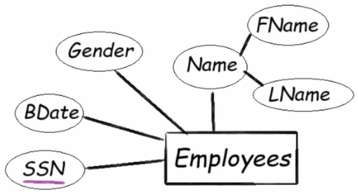{width=65%}

:::

::: {.columns .ragged columngap=1em}

Department Entity Attributes:

- `DName`
- `DNUM` (Unique)
- `Location` (Multiple)

\columnbreak

{width=65%}
:::

::: {.columns .ragged columngap=1em}

Project Entity Attributes:

- `PName`
- `PNumber` (Unique)
- `Location`
- `City`

\columnbreak

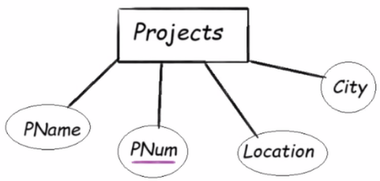{width=65%}

:::

::: {.columns .ragged columngap=1em}

Dependents Entity Attributes: (Weak Entity)

- `Name` (Unique) - Partial Key since it's a weak entity
- `Gender`
- `BDate`

\columnbreak

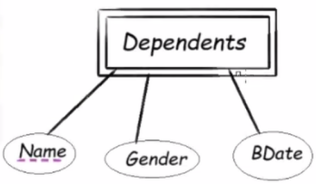{width=60%}

:::

**_Relations_**

Employees and Dependents:

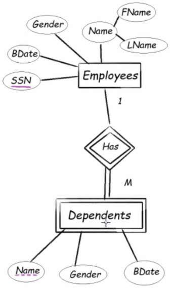{width=200px}

Employees and Departments:

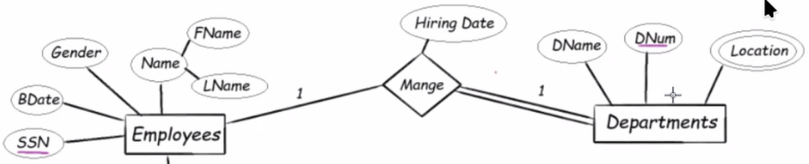{width=80%}

Employees and Departments:

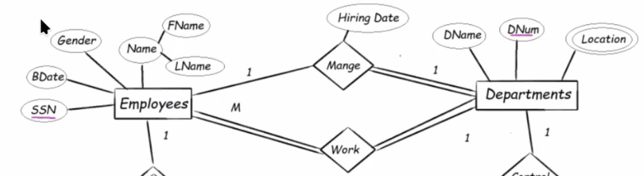{width=80%}

**_Final ERD_**

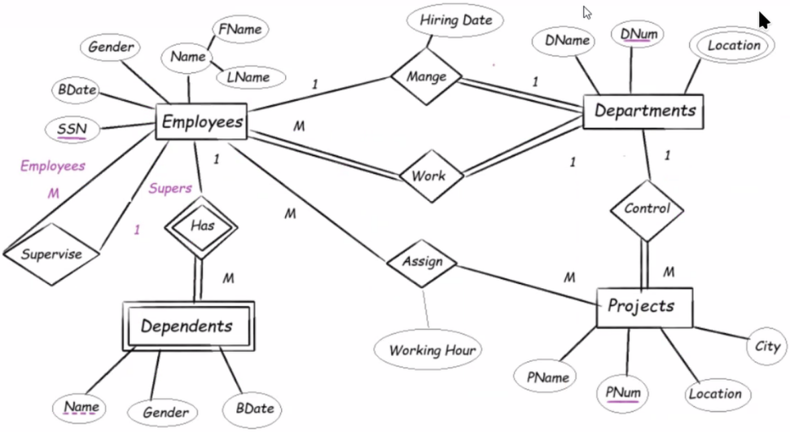{width=80%}
