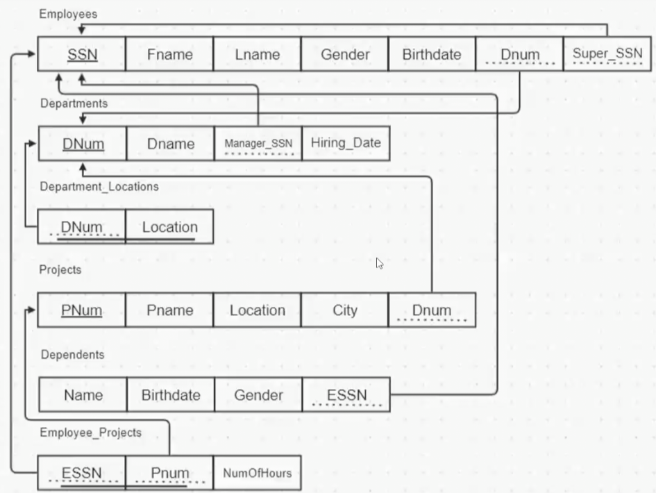
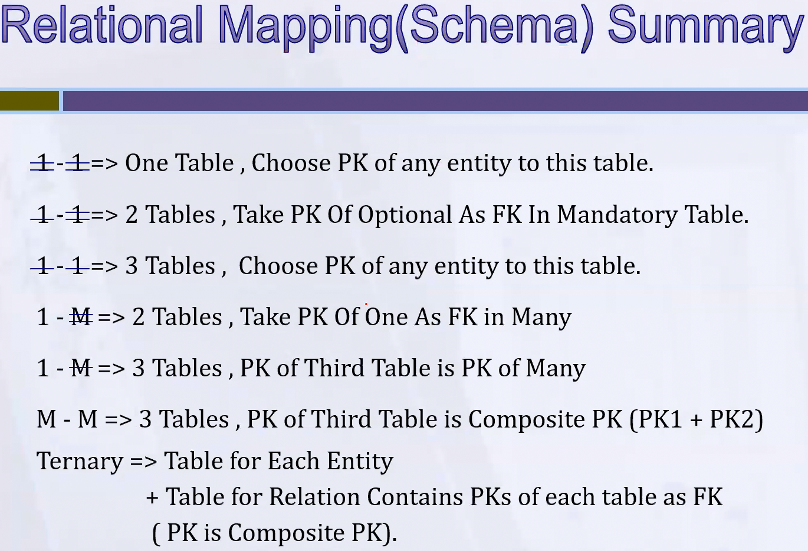

\begin{center}
\textbf{\textit{Don't depend on this session notes only, read the presentation too!}}
\end{center}

# Database Mapping

In this session we will continue acting as a DB designer.

After creating the ERD we start database mapping to create the database schema. The DB schema contains the details needed for implementation.

After finishing database mapping and creating the schema, we start implementing the database.

> _Remember_: ERD shows the main entities of the system, their attributes, and the relationships between them. It's an initial step in designing a database since it doesn't include all the details needed for implementation.

\begin{box4}{Note:}{blue}
If multiple developers work on the same SRS to create an ERD, each developer might produce a different ERD based on their understanding of the business, and all of them may be correct. But when it comes to creating the DB schema, \textbf{there is only one correct DB schema for that ERD}.

\tcblower

We say the DB schema from ERD is right if it satisfies the following properties:

\begin{itemize}
\item It doesn't contain any redundancy, unless it's necessary.
\item It doesn't contain any NULL values, unless it's necessary.
\end{itemize}

\end{box4}

<!-- {width=50%} -->

A relational DB is a DB that has relation between its tables. So for example you can't say that you have an employee called John, working in a department called HR, without having a department called HR in the DB. There is a relationship between departments and employees tables.

Un-relational DBs are DBs that don't have relationships between their tables, which removes a lot of the constraints that relational DBs have.

Most of the big companies use relational DBs because they need their data to be consistent and constrained.

In memory database is used for caching.

Relation is a table while relationship is a connection between tables.

Tables names are always plural.

DB is an object that have other objects inside it, like tables, views, functions, indexes, triggers, etc.

| Word                   | Definition                                 |
| ---------------------- | ------------------------------------------ |
| Database               | a collection of tables.                    |
| Table/entity           | a collection of records.                   |
| Attribute/Column/field | a Characteristic of an entity              |
| Row/Record/tuble       | the specific characteristics of one entity |

# ER-to-Relational Mapping

Steps:

1. Mapping 1-1 relationship mandatory from 2 sides
2. Mapping of Regular (Strong) Entity Types, The attributes may simple, composite, multi-valued, complex, or derived (not stored in the DB).
3. Mapping of Weak Entity Types
4. Mapping of _Binary_ 1:1 Relationship Types
   - It has 3 different scenarios based on the participation of the entities in the relationship
5. Mapping of _Binary_ 1:N Relationship Types
   - It has 2 different scenarios based on the participation of the many side entity in the relationship and we don't care here about the participation of the one side entity in the relationship
6. Mapping of _Binary_ M:N Relationship Types
   - Only one scenario, regardless of the participation of the entities in the relationship
7. Mapping of **N-ary (Ternary)** Relationship Types
   - Only one scenario, regardless of the participation or cardinality of the entities in the relationship
8. Mapping of **Unary** Relationship

See details in slides

Avoid primary keys that are composed of more that two columns, since data is ordered by the primary key, so this will make ordering more complex, also data is retrieved by the primary key, so this will make retrieval more complex. If there is no two columns that can be used as a primary key, then you can add a new column to be the primary key.

Some people don't even use composite primary keys, they just use a new column as the primary key.

In most cases Derived attribute are not stored in the DB.

We have composite primary keys in the following cases:

1. PK of the multi-valued attribute table.
2. PK of the complex attribute table.
3. PK of the weak entity table.
4. PK of the third table in M:N binary relationship.

In binary relationship, we have a third table when:

1. 1:1 optional relationship from both sides.
2. 1:M with optional M side.
3. M:N relationship.

Foreign key is a primary key in another table, except in self relationship, the foreign key comes from the primary key of the same table. For example a manager which is an employee and manages other employees, so the `managerID` is a foreign key that comes from the `employeeID`.

With unary relationships, either 1:1 or 1:M it's better to use only one table, because it better than using two tables and having to join them.

{width=70%}

An attribute with a dashed line in ERD is called a partial key, while in the DB schema it's called a foreign key. There is nothing called a partial key in the DB schema.
