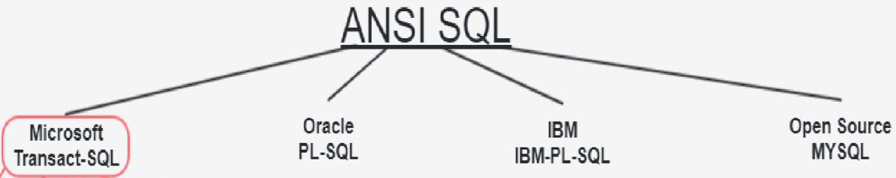
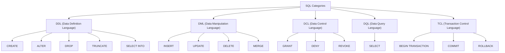
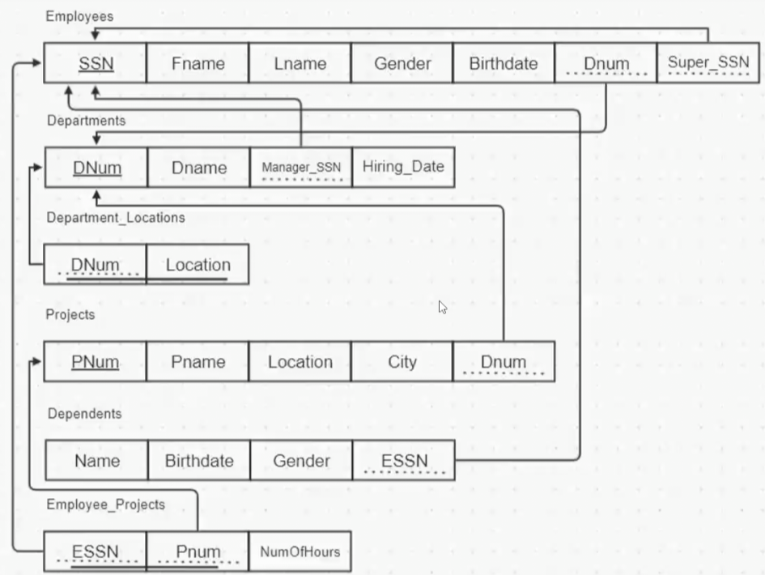
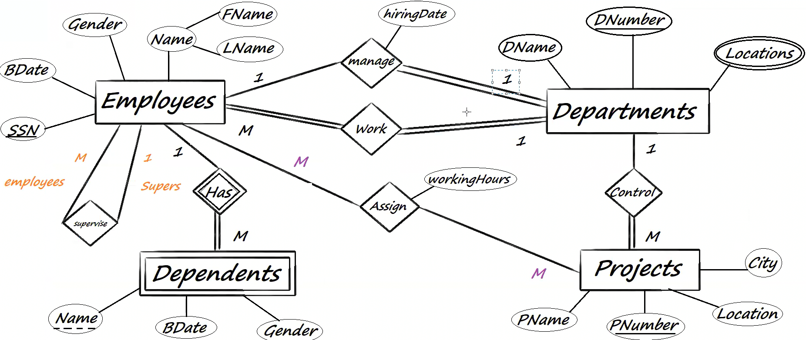
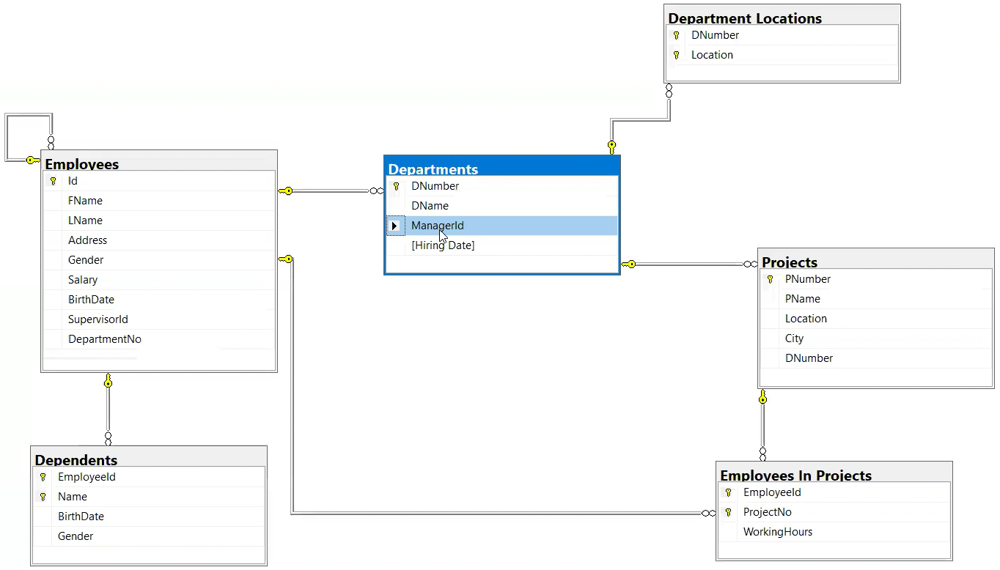
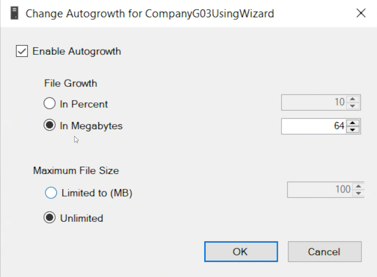
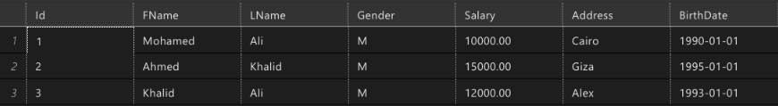

# First Part

Fast recap on the topics of previous sessions.

# SQL Server & SSMS (SQL Server Management Studio)

SQL Server is a windows service, and SSMS is the tool to interact with it. SSMS is only available for Windows.

To install SQL Server, go to the [official website](https://www.microsoft.com/en-us/sql-server/sql-server-downloads) and download the developer edition.

You can install multiple instances of SQL Server on the same machine. Each instance is a different service.

You can see the currently running services in your windows machine by searching for services in the start menu and looking for SQL Server.

In windows to connect to sql server via CMD you can use the command:

```
sqlcmd /S "."
1> // THIS IS THE SQL COMMAND LINE FOR `master` DATABASE
```

The `"."` means the local machine, you can replace it with the name of the server you want to connect to.

There are multiple types of authentication, the most common are Windows Authentication and SQL Server Authentication.

Windows Authentication is the default and it uses the windows user to authenticate. SQL Server Authentication uses a username and password.

After connecting to SQL Server you will get the SQL Command Line, where you can write SQL commands.

SQL Server has 4 databases: `master`, `tempdb`, `model`, `msdb`. It uses `master` by default.

To change the current DB inside the SQL Command Line you can use the command:

```
> USE [database_name]
> GO
Changed database context to 'database_name'.
```

After installing and opening SSMS you will get a wizard to connect to a server. You should choose the Server Type as `Database Engine`, and the Server Name as `.` if you are connecting to the local machine. If you are connecting to a remote machine you should use the domain name or IP address as the Server Name. Finally, you should choose the Authentication Type.

To connect to a remote server via windows authentication you can also use remote desktop application to connect to the server and then connect to the SQL Server using SSMS.

Data migration is the process of transferring data between different systems. For example, when a customer moves from a legacy system to a new system with a different database, data migration is required.

In SSMS you can connect to multiple servers at the same time, and you can see the list of servers in the Object Explorer.

To start writing SQL commands in SSMS you can click on the `New Query` button in the toolbar.

To run a part of the code in SSMS you can select the code and press `F5` or click on the `Execute` button in the toolbar.

# SQL (Structured Query Language)

SQL stands for Structured Query Language. It's the language used to communicate with the database.

SQL was initially developed by IBM in the early 1970s and became a standard of the American National Standards Institute (ANSI) in 1986. Then corporations like Oracle, Microsoft, and MySQL developed their own versions of SQL.

Microsoft's SQL Server uses T-SQL (Transact-SQL) which is an extension of SQL.

{width=70%}

T-SQL itself is divided into 5 languages:

1. DDL (Data Definition Language): Used to define the metadata and structure of the database. For example the names of the tables, the columns, the data types, etc. Used keywords are `CREATE`, `ALTER`, `DROP`, `TRUNCATE` (drops the table and creates it again), `SELECT INTO`.
2. DML (Data Manipulation Language): Used to manipulate the data inside the database. Used keywords are `INSERT`, `UPDATE`, `DELETE`, `MERGE`.
3. DCL (Data Control Language): Used to control the access, security, and permissions of the database. Used keywords are `GRANT`, `DENY`, `REVOKE`.
4. DQL (Data Query Language): Used to query the data inside the database (Just Display). Used keyword is `SELECT + ...`. What comes after `SELECT` can be grouping, aggregate function, column name, union, join, subquery, etc.
5. TCL (Transaction Control Language): Used to manage the transactions in the database. Used keywords are `BEGIN TRANSACTION`, `COMMIT`, `ROLLBACK`.



SQL is used to query the structure of a database. When we say "structure" we mean the database itself and the objects inside it like tables.

Always when starting to write a SQL code in a file check the connection string of that file. The connection string shows three things: the server name, the database name, and the authentication type. You must do that because you may think you are connected to a specific server and running a query to delete a table, but you are actually connected to another server and you will delete a table in that server.

In SSMS the yellow bar on the left side of the query means that the query is not saved. The green bar means that the query is saved.

In SQL everything you do with code can be done with wizard but we use code because its faster and more efficient. For example to choose the DB you will work on you can use `USE [database_name]` or you can just choose the DB from the toolbar in SSMS.

If you have a large query that does something always write a comment on top of it to explain what it does.

SQL Server is not case sensitive in both the data and the SQL code. You can write the keywords in uppercase or lowercase.

To write a comment in SQL you can use `--` or `/* */`.

# SQL Data Types

You don't specify the data types as a developer, the business consultant specifies the data types in the RSD (Requirement Specification Document).

## Numeric Data Types

| Data Type  | Description                                |
| ---------- | ------------------------------------------ |
| `bit`      | 1 bit, 0 or 1 (There is no boolean in SQL) |
| `tinyint`  | 1 byte, 0 to 255 OR -128 to 127            |
| `smallint` | 2 bytes, -32,768 to 32,767 OR 0 to 65,555  |
| `int`      | 4 bytes, -2,147,483,648 to 2,147,483,647   |
| `bigint`   | 8 bytes, VERY BIG NUMBER                   |

## Fractional Data Types

| Data Type                                          | Description                                                           |
| -------------------------------------------------- | --------------------------------------------------------------------- |
| `smallmoney`                                       | 4B.0000 (4 bytes before the dot and 4 decimal places)                 |
| `money`                                            | 8B.0000 (8 bytes before the dot and 4 decimal places)                 |
| `real`                                             | 8B.0000000 (8 bytes before the dot and 7 decimal places)              |
| `float`                                            | 8 bytes before the dot and 15 decimal places                          |
| `decimal(total_num_of_digits, num_of_frac_digits)` | Data type and makes validations at the same time (Recommended)        |
| `decimal`                                          | Without specifying the total number of digits, it is `decimal(18, 0)` |

Example on `decimal`: `decimal(5, 2)` means 5 digits in total and 2 decimal places. If the decimal places are more than 2 it will round the number, but if the integer part is more than 3 it will throw an error.

Example with `decimal(5, 2)`:

| Number  | Validity                     |
| ------- | ---------------------------- |
| 123.45  | Valid                        |
| 123.456 | Valid (Will round to 123.46) |
| 1234.5  | Invalid                      |

See [Decimal Data Type Documentation](https://learn.microsoft.com/en-us/sql/t-sql/data-types/decimal-and-numeric-transact-sql) for more information.

## String Data Types

| Data Type       | Description                                                                    |
| --------------- | ------------------------------------------------------------------------------ |
| `char(n)`       | Fixed length, n is the number of characters.                                   |
| `varchar(n)`    | Variable length, n is the maximum number of characters.                        |
| `varchar(max)`  | Variable length, up to 2GB of characters.                                      |
| `nchar(n)`      | Like `char(n)` but for u[n]{.underline}icode characters (Different Languages). |
| `nvarchar(n)`   | Like `varchar(n)` but for unicode characters.                                  |
| `nvarchar(max)` | Like `varchar(max)` but for unicode characters.                                |

In `varchar(n)`, if you insert a string with more characters than `n` it will truncate the string. For example, if you have `varchar(10)` and you insert a string with 15 characters, it will store only the first 10 characters.

There is also `text()`, `ntext()` but they are deprecated.

`char` is better in performance but worse in storage. `varchar` is better in storage but worse in performance.

## Date and Time Data Types

<!-- prettier-ignore-start -->

| Data Type        | Description                                                                                                                                |
| ---------------- | ------------------------------------------------------------------ |
| `date`           | Date only, depends on the date format of the operating system that hosts the instance of SQL Server, and you must use that OS date format. |
| `TIME`           | Time only, takes hours, minutes, seconds, and 3 decimal places for milliseconds.                                                           |
| `TIME(n)`        | Time only, takes hours, minutes, seconds, and n decimal places for milliseconds.                                                           |
| `smallDateTime`  | Date and time, in time it keeps seconds as 0.                                                                                              |
| `DateTime`       | Like `smallDateTime` but keeps seconds, and 3 decimal places for milliseconds.                                                             |
| `DateTime2(n)`   | Like `DateTime` but with n decimal places for milliseconds.                                                                                |
| `datetimeOffset` | Saves date, time, and time zone.                                                                                                           |

<!-- prettier-ignore-end -->

## Binary Data Types

Used to store files like images, videos, PDFs, etc.

<!-- prettier-ignore-start -->

| Data Type        | Description                                                                              |
| ---------------- | ------------------------------------------------------------- |
| `binary(n)`      | Fixed length, n is the number of bytes. Without specifying the length it is `binary(1)`. |
| `varbinary`      | Variable length of bytes.                                                                |
| `varbinary(max)` | Variable length, up to 2GB of bytes.                                                     |
| `image`          | Used to store images                                                                     |

<!-- prettier-ignore-end -->

It's not recommended to store binary data in the database, it's better to store the data in the server and save the path in the database.

## Other Data Types

| Data Type     | Description                 |
| ------------- | --------------------------- |
| `XML`         | Used to store XML data.     |
| `sql_variant` | Can store any type of data. |

# Variables in SQL

## Global Variables

Global variables are the built-in variables in SQL Server. They start with `@@`.

You can't define global variables, you can only use them.

| Variable Name  | Description                            |
| -------------- | -------------------------------------- |
| `@@version`    | Returns the version of the SQL Server. |
| `@@servername` | Returns the name of the server.        |

## Local Variables

Local variables are defined by the user and they start with `@`.

To define a local variable you can use the `DECLARE` keyword.

```{.sql .numberLines}
DECLARE @variable_name data_type
```

For example:

```{.sql .numberLines}
DECLARE @StudentName varchar(10) = 'Ahmed'
```

**_There is no double quotes in SQL, you can only use single quotes._**

To print the value of a variable you can use the `PRINT` keyword.

```{.sql .numberLines}
PRINT @variable_name
```

To change the value of a variable you can use the `SET` keyword.

```{.sql .numberLines}
DECLARE @StudentName varchar(10) = 'Ahmed'
SET @StudentName = 'Mohamed'
```

# DDL (Data Definition Language)

DDL is used to define the metadata and structure of the database, for example creating a database or objects inside it like tables, views, functions, etc.

To create a database you can use the `CREATE DATABASE` keyword.

```{.sql .numberLines}
CREATE DATABASE database_name
```

To create a table you can use the `CREATE TABLE` keyword.

```{.sql .numberLines}
CREATE TABLE table_name (
    column1_name data_type,
    column2_name data_type,
    ...
)
```

## Schema Implementation Example

Let try to implement the following schema:

{width=60%}

> **_We will use id instead of SSN_**

### Employees Table

```{.sql .numberLines}
CREATE TABLE Employees
(
    Id INT PRIMARY KEY IDENTITY(1,1),
    FName VARCHAR(40) NOT NULL,
    LName VARCHAR(40) NOT NULL,
    Gender CHAR(1), -- F or M
    BirthDate DATE,
    DepNum INT,-- references Departments
    SuperId INT REFERENCES Employees(Id),
)
```

Some notes on the above code:

- `IDENTITY(1, 1)` means that the `Id` column will start from 1 and increment by 1. The user will not enter the value of the `Id` column, it will be auto-generated. If it's `IDENTITY(1, 2)` it will start from 1 and increment by 2, the 1 here is called **Seed**. There is also something called _Sequence_ in SQL Server that can be used to generate the values of the `Id` column but we will talk about it later.
- The maximum number of characters reserved for the `FName` and `LName` columns should be specified in the Specification Document.
- SQL allows NULLs by default, and to prevent that you can use the `NOT NULL` keyword.
- If we want to add a column for salary and that salary should not exceed 1 million we can use `Salary DECIMAL(8, 2)`{.sql}, because it has a maximum value of 999999.99.
- Since `DepNum` should be a foreign key to the `Departments` table, and we didn't create the `Departments` table yet, we will add it later using the `ALTER` keyword.
- `SuperId INT REFERENCES Employees(Id)`{.sql} is a self-referencing foreign key. It means that the `SuperId` column is a foreign key to the `Id` column in the same table.
- If we want to add an extra column like `Address` with a default value of `Cairo` we can use: `Address VARCHAR(100) DEFAULT 'Cairo'`{.sql}.

### Departments Table

```{.sql .numberLines}
CREATE TABLE Departments
(
    DepNum INT PRIMARY KEY,
    DepName VARCHAR(40) NOT NULL,
    ManagerId INT REFERENCES Employees(Id),
    [Hiring Date] DATE
)
```

Some notes on the above code:

- The `DepNum` column is the primary key of the table. Any primary key should be unique and not null.
- The `ManagerId` column is a foreign key to the `Employees` table.
- If we want to have a column name with more than one word we should use square brackets `[]`, like in `[Hiring Date]`.

### Department Locations Table

```{.sql .numberLines}
CREATE TABLE [Department Locations]
(
    DepNum INT REFERENCES Departments(DepNum),
    Location VARCHAR(100),
    PRIMARY KEY(DepNum, Location)
)
```

Some notes on the above code:

- The `DepNum` column is a foreign key to the `DepNum` column in the `Departments` table.
- The primary key of the table is a composite key that consists of the `DepNum` and `Location` columns.

### Projects Table

```{.sql .numberLines}
CREATE TABLE Projects
(
    PNum INT PRIMARY KEY IDENTITY(100,100),
    PName VARCHAR(100) NOT NULL,
    Location VARCHAR(100),
    City VARCHAR(100),
    DepNum INT NOT NULL REFERENCES Departments(DepNum)
)
```

### Dependents Table

```{.sql .numberLines}
CREATE TABLE Dependents
(
    [Name] VARCHAR(50),
    EmpId INT REFERENCES Employees(Id),
    PRIMARY KEY(EmpId, [Name]),
    BirthDate DATE,
    Gender CHAR(1),
)
```

Some notes on the above code:

- Sometimes if your column name is similar to a keyword in SQL, you will see it highlighted similar to the keywords. To avoid that you can use square brackets `[]` around the column name, like in `[Name]` above.

### Employees in Project Table

```{.sql .numberLines}
CREATE TABLE EmployeesInProject
(
    EmpId INT REFERENCES Employees(Id),
    PNum INT REFERENCES Projects(PNum),
    WorkingHours INT,
    PRIMARY KEY(EmpId, PNum)
)
```

### Some Extra Changes

This is the ERD of the schema:

{width=60%}

And this is the diagram of the schema from SSMS:

{width=60%}

As you can see the `manage` relation between `Departments` and `Employees` is 1 to 1 total participation from the `Departments` side, but in the SSMS diagram, that relation is not implemented, so we need to make the `ManagerId` column in the `Departments` table a unique and not null column.

[in the next section](#changes-in-the-schema)

---

SQL is very flexible with its syntax, you can write the same code in multiple ways. For example, Both of the following codes are correct:

::: {.columns .ragged columngap=2.5em}

Define column with primary key in one line:

```{.sql .numberLines}
id INT PRIMARY KEY IDENTITY(1, 1)
```

\columnbreak

Define column with primary key in two lines:

```{.sql .numberLines}
id INT IDENTITY(1, 1),
PRIMARY KEY(id)
```

:::

Similarly:

```{.sql .numberLines}
SuperId INT REFERENCES Employees(Id)
-- And
SuperId INT,
FOREIGN KEY(SuperId) REFERENCES Employees(Id)
```

---

Database consists of schemas and each schema consists of a collection of objects, for example, we can have a schema for orders, a schema for payment, etc. Each one of those schemas has the objects (tables, views functions, objects) related to it.

To create a table in a specific schema you should use `schema.table_name`. If you don't specify the schema it will use the default schema which is `dbo` (database owner).

---

Any Primary Key is always Unique & NOT NULL, while Unique key allows NULL only once since it's unique.

## `ALTER`

`ALTER` is used to update the structure of the database or its objects.

### `ALTER DATABASE`

To change the name of the database:

```{.sql .numberLines}
ALTER DATABASE database_name
MODIFY NAME = new_database_name
```

Sometimes the command will take a long time. This is because the database is locked and the command is waiting for the lock to be released (This will be explained in details later).

<!-- , to avoid that now you can disconnect from the database and reconnect as a temporary solution. -->

You can see other options that come after `ALTER DATABASE` in [Microsoft Docs](https://learn.microsoft.com/en-us/sql/t-sql/statements/alter-database-transact-sql). Most of them can be done from the GUI.

### `ALTER TABLE`

`ALTER TABLE` can have different commands like `ADD`, `DROP`, `ALTER`. This diagram shows the different commands and their sub-commands:

::: {.columns columngap=2.5em}

```{.mermaid .ragged width=80% caption="Alter Commands"}
graph LR
    A[ALTER]
    A --> B[Add]
    A --> D[Alter]
    A --> C[Drop]
    B --> B1[New Column Name]
    B --> B2[Constraints]
    C --> C1[Column Name]
    C --> C2[Constraints]
    D --> D1[Column Name]
```

\columnbreak

Example code:

```{.sql .numberLines}
ALTER TABLE Employees
ADD NetSalary INT

ALTER TABLE Employees
ALTER COLUMN NetSalary BIGINT

ALTER TABLE Employees
DROP COLUMN NetSalary
```

:::

<!--
graph TD
    A[ALTER]
    A -\-> B[Add]
    A -\-> C[Drop]
    A -\-> D[Modify]
    A -\-> E[Rename]
    B -\-> B1[New Column Name]
    B -\-> B2[Constraints]
    C -\-> C1[Column]
    C -\-> C2[Constraints]
    D -\-> D1[Datatype]
    D -\-> D2[Size]
    E -\-> E1[Column]
-->

#### Changes In The Schema

Now lets fix some the issues in the schema, we mentioned in [the previous section](#some-extra-changes).

\begin{box4}{\textbf{Note:}}{blue}
After creating a relation between two tables in SQL, you can't change it. You have to drop the relation and create it again.
\end{box4}

##### Fix `Manage` Relation

1. First we need to drop the foreign key relation between the `Employees` and `Departments` tables.

```{.sql .numberLines}
ALTER TABLE Departments
DROP CONSTRAINT FK__Departmen__Manag__3B75D760 -- This is the name of the constraint from the wizard
```

2. Then we can change the `ManagerId` column in the `Departments` table to be a not NULL first then unique.

```{.sql .numberLines}
ALTER TABLE Departments
ALTER COLUMN ManagerId INT NOT NULL

ALTER TABLE Departments
ADD CONSTRAINT UQ_ManagerId UNIQUE(ManagerId)

-- OR You can remove `CONSTRAINT UQ_ManagerId`
ALTER TABLE Departments
ADD UNIQUE([Manager Id]);
```

3. Now we can add the foreign key relation between the `Employees` and `Departments` tables again.

```{.sql .numberLines}
ALTER TABLE Departments
ADD CONSTRAINT FK__Departmen__Manag__3B75D760 FOREIGN KEY(ManagerId) REFERENCES Employees(Id)

-- You can also remove `CONSTRAINT FK__Departmen__Manag__3B75D760`
ADD FOREIGN KEY(ManagerId) REFERENCES Employees(Id)
```

<!-- 1. Make the `ManagerId` column in the `Departments` table a unique and not NULL column.

```{.sql .numberLines}
ALTER TABLE Departments
ADD CONSTRAINT UQ_ManagerId UNIQUE(ManagerId)
````

This adds a unique constraint with the name `UQ_ManagerId` on the `ManagerId` column in the `Departments` table.

2. Change the `DepNum` column in the `Employees` table to be a foreign key to the `Departments` table. -->

###### Fix `Works` Relation

When we were creating the `Employees` table we couldn't add the `Work` relation because the `Departments` table wasn't created yet. Now we can add the `DepNum` column in the `Employees` table as a foreign key to the `Departments` table using `ALTER`.

```{.sql .numberLines}
ALTER TABLE Employees
ADD FOREIGN KEY(DepNum) REFERENCES Departments(DepNum)
```

## `DROP`

`DROP` is used to delete the database or its objects.

Example:

```{.sql .numberLines}
DROP DATABASE database_name

DROP TABLE table_name

DROP FUNCTION function_name

DROP VIEW view_name
```

To clear the data from a table without deleting the table itself you can use:

```{.sql .numberLines}
TRUNCATE TABLE table_name
```

We can also use:

```{.sql .numberLines}
DELETE FROM table_name
```

But this will take more time because it will delete the rows one by one.

It's better to use `DELETE` when you have a condition to delete specific rows, and use `TRUNCATE` when you want to delete all the rows.

## DDL Using Wizard

**_Watch the video for this part._**

Discussed Topics:

1. Creating New DB And Changing Owner
2. Creating Tables
3. Allowing/Preventing saving changes that require table re-creation
4. Creating Relations from the ERD

### Notes

Each DB consists of two files: `.mdf` and `.ldf`. MDF stands for metadata file. the `.mdf` file has both the metadata and data of the DB. LDF stands for Log Data File and the `.ldf` file has the logs and transactions of the DB.

LDF is only one file, while MDF can be more than one file and they can be grouped in a file group. You can create more MDF files from GUI and change their size, group, size, auto growth, etc.

The initial size of each file is 8MB and it can grow by 64MB and they have no limit on the maximum size. You can change the initial size and the growth rate of the files from the GUI too like so:

{width=50%}

It's better to use wizard than code for tasks like changing the configuration of the DB.

If you want to send the DB to someone you can't just copy the `.mdf`, `.ldf` files, you have to create a backup from the DB and send the `.bak` file.

\begin{box4}{\textbf{Note:}}{blue}
To avoid the problem of having to change the relations after creating tables, you can just create the tables first without adding any relations, then add the relations after creating all the tables.
\end{box4}

# DML (Data Manipulation Language)

DML is used for manipulating the data inside the database like inserting, updating, and deleting data.

## `INSERT`

We have two types of `INSERT`:

1. Simple insert in which we add only one row.
2. Row constructor in which we add multiple rows.

There are other types of insert but we will discuss them later.

### Simple Insert

To insert data into `Employees` column:

```{.sql .numberLines}
INSERT INTO Employees

-- the values must be in the same order as the columns in the table
VALUES
(
    'Ahmed', -- FName
    'Ali',   -- LName
    'M',     -- Gender
    '1995-01-01', -- BirthDate
    1,       -- DepNum
    1        -- SuperId
)
```

Notes on the above code:

1. We didn't enter the value for the `Id` column because it's an `IDENTITY` column and auto-generated by SQL Server.
2. The date should be in the same format as the date format of the operating system that hosts the instance of SQL Server.

We can also specify the columns we want to insert data into:

```{.sql .numberLines}
INSERT INTO Employees(FName, LName)
VALUES('Ahmed', 'Ali')
```

\begin{box4}{\textbf{Important Note on Inserting Subset of Data}}{blue}
When inserting data for just a subset of columns like in the above code, the columns that are not specified must be one of the following:

\begin{itemize}
\tightlist
\item Have a default value.
\item Allow NULLs.
\item Be an \texttt{IDENTITY} column.
\end{itemize}
\end{box4}

### Row Constructor

To insert multiple rows at once:

```{.sql .numberLines}
INSERT INTO Employees(FName, LName, Gender)
VALUES
    ('Ahmed', 'Ali', 'M'),
    ('Mohamed', 'Ali', 'M'),
    ('Fatma', 'Ali', 'F')
```

## `UPDATE`

Suppose we have this table:

{width=90%}

And we want to change the value of `FName` in all rows to be `Mohamed`:

```{.sql .numberLines}
UPDATE Employees
SET FName = 'Mohamed'
```

But if we want to change the value of `FName` in only rows with `Id` less than 4:

```{.sql .numberLines}
UPDATE Employees
SET FName = 'Mohamed'
WHERE Id < 4
```

We can also change multiple values at once:

```{.sql .numberLines}
UPDATE Employees
SET FName = 'Mohamed', LName = 'Ali'
```

This will change the `FName` and `LName` columns in all rows.

We can also change a value of a column based on its current value:

```{.sql .numberLines}
UPDATE Employees
SET Salary = Salary + Salary * 0.1
-- OR
SET Salary += Salary * 0.1
-- OR
SET Salary = Salary * 1.1
```

We can also add `WHERE` condition to the above code to change the salary of only employees with `Id` less than 4.

```{.sql .numberLines}
UPDATE Employees
SET Salary += Salary * 0.1
WHERE Id < 4
```

When using `WHERE` we can specify more than one condition:

```{.sql .numberLines}
UPDATE Employees
SET Salary += Salary * 0.1
WHERE Id < 4 AND Salary > 1000
```

## `DELETE`

To delete all rows in the `Employees` table:

```{.sql .numberLines}
DELETE FROM Employees
```

To delete rows with `Id` less than 4:

```{.sql .numberLines}
DELETE FROM Employees
WHERE Id < 4
```

## DML Using Wizard

Insert, Update, and Delete using the GUI.
