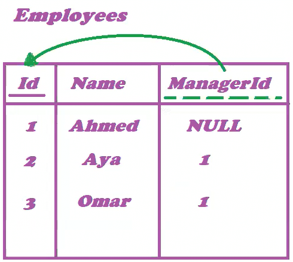
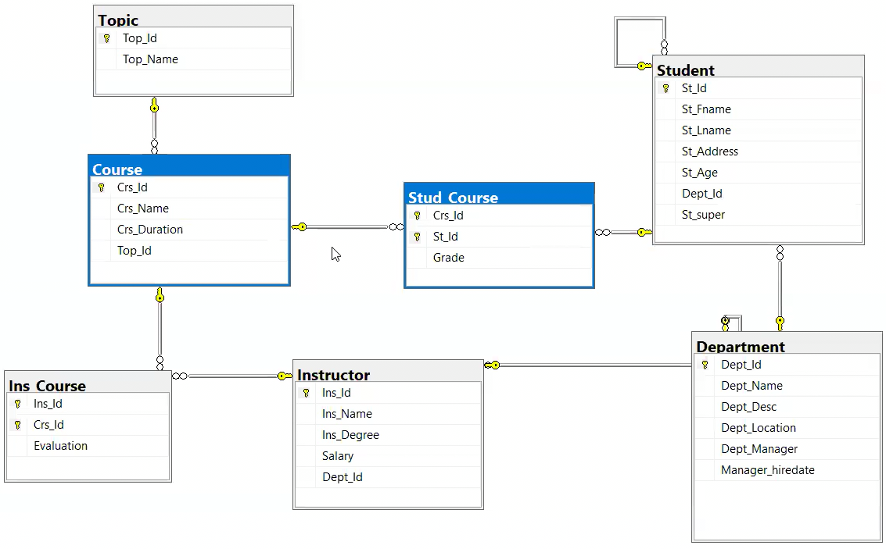

# DQL (Data Query Language)

DQL is used to display data from the database. The most common DQL command is `SELECT`.

DQL doesn't affect the actual data in the DB.

\begin{box4}{\textbf{Important Note:}}{blue}
When reading a SQL query read it with the order in which it gets executed (This is important in interviews).

You should also know how to divide the query into parts because this will help you understand complex queries later.
\end{box4}

Data in DB is stored in ascending ordered with the primary key.

In the examples here we will use adventureworks database. You can [download it here](https://learn.microsoft.com/en-us/sql/samples/adventureworks-install-configure?view=sql-server-ver16&tabs=ssms#download-backup-files)

# Example `SELECT` Statements

To specify I want to use `adventureworks` database I will use the following command:

```{.sql .numberLines}
-- This depends on how you named it when you restored the database
USE adventureworks;
```

Select all columns from `Product` table in `SalesLT` schema.

```{.sql .numberLines}
SELECT *
FROM SalesLT.Product;
```

Select `ProductID`, `Name` and `ProductNumber` columns from `Product` table in `SalesLT` schema.

```{.sql .numberLines}
SELECT ProductID, Name, ProductNumber
FROM SalesLT.Product;
```

Select `ProductID`, `Name` and `ProductCategoryID` columns from `Product` table in `SalesLT` schema where `ProductCategoryID` is greater than or equal to 40.

```{.sql .numberLines}
SELECT ProductID, Name, ProductCategoryID
FROM SalesLT.Product
WHERE ProductCategoryID >= 40;
```

Select `ProductID`, `Name` and `ProductCategoryID` columns from `Product` table in `SalesLT` schema where `ProductCategoryID` is greater than or equal to 40 and less than or equal to 50.

```{.sql .numberLines}
SELECT ProductID, Name, ProductCategoryID
FROM SalesLT.Product
WHERE ProductCategoryID >= 40 AND ProductCategoryID <= 50;

-- OR use the BETWEEN operator
SELECT ProductID, Name, ProductCategoryID
FROM SalesLT.Product
WHERE ProductCategoryID BETWEEN 40 AND 50;
```

Select `ProductID`, `Name` and `ProductCategoryID` columns from `Product` table in `SalesLT` schema where `ProductCategoryID` is **_NOT_** greater than or equal to 40 and less than or equal to 50.

```{.sql .numberLines}
SELECT ProductID, Name, ProductCategoryID
FROM SalesLT.Product
WHERE ProductCategoryID NOT BETWEEN 40 AND 50;
```

Select `ProductID`, `Name` and `Color` columns from `Product` table in `SalesLT` schema where `Color` is either `Black` or `Red`.

\begin{box4}{Note:}{black}
SQL can only use single quotes \texttt{'} with strings.
\tcblower
SQL is case-insensitive so \texttt{Black} and \texttt{black} are the same.
\end{box4}

```{.sql .numberLines}
SELECT ProductID, Name, Color
FROM SalesLT.Product
WHERE Color = 'Black' OR Color = 'Red' OR Color = 'Silver';
```

As an alternative to the above query you can use the `IN` operator.

```{.sql .numberLines}
SELECT ProductID, Name, Color
FROM SalesLT.Product
WHERE Color IN ('Black', 'Red', 'Silver');

-- NOT IN
SELECT ProductID, Name, Color
FROM SalesLT.Product
WHERE Color NOT IN ('Black', 'Red', 'Silver');
```

If we want to get rows where `SellEndDate` is `NULL` we can use the `IS NULL` operator. We can't use `=` operator with `NULL`.

```{.sql .numberLines}
SELECT ProductID, Name, SellEndDate
FROM SalesLT.Product
WHERE SellEndDate IS NULL;
```

The `LIKE` operator is used to search for a specified pattern in a column.

With `LIKE` you can use the following wildcards:

1. `%` - Zero or more characters.
2. `_` - A single character.

You can also use `[]` to specify a range/set of characters:

1. `[a-z]` - Any lowercase letter.
2. `[A-Z]` - Any uppercase letter.
3. `[0-9]` - Any digit.
4. `[a-zA-Z]` - Any letter.
5. `[^a-z]` - Any character that is not a lowercase letter.
6. `[^0-9]` - Any character that is not a digit.
7. `[^a-zA-Z]` - Any character that is not a letter.
8. `[abc]` - Any character that is `a`, `b` or `c`.
9. `[%]` - The `%` inside `[]` is treated as a normal percentage character, while outside it is a wildcard.
10. `[_]` - The `_` inside `[]` is treated as a normal underscore, while outside it is a wildcard.

Examples:

```{.sql .numberLines}
-- Products that have 'e' or 'E' as a second character in the name
SELECT ProductID, Name
FROM SalesLT.Product
WHERE Name LIKE '_E%';

-- Ends with 'Wheel'
SELECT ProductID, Name
FROM SalesLT.Product
WHERE Name LIKE '%Wheel';

-- Starts with 'Road'
SELECT ProductID, Name
FROM SalesLT.Product
WHERE Name LIKE 'Road%';

-- Contains 'Road' anywhere in the name
SELECT ProductID, Name
FROM SalesLT.Product
WHERE Name LIKE '%Road%';
```

More examples:

- `'a%h'`: Starts with `a` and ends with `h`.
- `'%a_'`: `a` is the second last character.
- `'[ahm]%'`: Starts with `a`, `h` or `m`.
- `'[^ahm]%'`: Doesn't start with `a`, `h` or `m`.
- `'[a-h]%'`: Starts with any character from `a` to `h`.
- `'^[a-h]%'`: Doesn't start with any character from `a` to `h`.
- `'[356]%'`: Starts with `3`, `5` or `6`.
- `'%[%]'`: Ends with `%`.
- `'%[_]%'`: Contains `_`.
- `'[_]%[_]'`: Starts and ends with `_`.

To Select just unique values you can use the `DISTINCT` keyword.

```{.sql .numberLines}
SELECT DISTINCT Color
FROM SalesLT.Product;
```

To order the result:

```{.sql .numberLines}
SELECT ProductID, Name, Color
FROM SalesLT.Product
ORDER BY Color;

-- DESC for descending order
SELECT ProductID, Name, Color
FROM SalesLT.Product
ORDER BY Color DESC;

-- Multiple columns
-- If two rows have the same value for the first column,
-- the order of the primary key is used to determine the order.
-- But here we are using the second column `Name` to determine the order
-- if the values in the first column (Color) are the same.
SELECT ProductID, Name, Color
FROM SalesLT.Product
ORDER BY Color, Name;

-- Different order for each column
SELECT ProductID, Name, Color
FROM SalesLT.Product
ORDER BY Color DESC, Name;

-- Use the number of the column instead of the name
SELECT ProductID, Name, Color
FROM SalesLT.Product
ORDER BY 3, 2; -- 3rd column then 2nd column in the selection
```

# Joins

We need to use Joins when we need to select data from multiple tables.

## Cross Join (Cartesian Product)

It's named cartesian product because it similar to the cartesian product in mathematics. Cartesian product of two sets is the set of all possible combinations of the elements of the two sets, which what happens in the cross join.

Suppose we have those two tables:

Table: Departments Table

| ID  | Name  |
| --- | ----- |
| 10  | Sales |
| 20  | IS    |
| 30  | HR    |
| 40  | Admin |

Table: Employees Table

| ID  | Name  | DeptID |
| --- | ----- | ------ |
| 1   | Ahmed | 10     |
| 2   | Aya   | 10     |
| 3   | Ali   | 20     |
| 4   | Osama | `NULL` |

`ID` is the primary key in both tables.

`DeptID` is a foreign key that references the `ID` column in the `Departments` table.

The cross join of those two tables, gives us this combination:

Table: Cross Join Result

| E.Name | D.Name |
| ------ | ------ |
| Ahmed  | Sales  |
| Aya    | Sales  |
| Ali    | Sales  |
| Osama  | Sales  |
| Ahmed  | IS     |
| Aya    | IS     |
| Ali    | IS     |
| Osama  | IS     |
| Ahmed  | HR     |
| Aya    | HR     |
| Ali    | HR     |
| Osama  | HR     |
| Ahmed  | Admin  |
| Aya    | Admin  |
| Ali    | Admin  |
| Osama  | Admin  |

Cross join has two different ways to write in SQL server:

::: {.columns .ragged columngap=1.5em column-rule="0.0pt solid black"}

1. ANSI Syntax:

```{.sql .numberLines}
SELECT E.Name, D.Name
FROM Employee E, Department D;
```

\columnbreak

2. Microsoft T-SQL Syntax:

```{.sql .numberLines}
SELECT E.Name, D.Name
FROM Employee E CROSS JOIN Department D;
```

:::

## Inner Join (Equi Join)

It's used to get the intersection of two tables.

The syntax of inner join is similar to cross join but with a `WHERE` condition. In the condition we have `PK = FK` (Primary Key = Foreign Key).

The result of the inner join of the two tables above is:

Table: Inner Join Result

| E.Name | D.Name |
| ------ | ------ |
| Ahmed  | Sales  |
| Aya    | Sales  |
| Ali    | IS     |

Inner join has two different ways to write in SQL server:

::: {.columns .ragged columngap=1.5em}

1. ANSI Syntax:

```{.sql .numberLines}
SELECT E.Name, D.Name
FROM Employee E, Department D
WHERE E.DeptID = D.ID;
```

\columnbreak

2. Microsoft T-SQL Syntax:

```{.sql .numberLines}
SELECT E.Name, D.Name
FROM Employee E CROSS JOIN Department D
ON E.DeptID = D.ID;
```

:::

Notice that in T-SQL syntax we used `ON` instead of `WHERE`.

## Outer Join

We have three types of outer joins:

1. Left Outer Join
2. Right Outer Join
3. Full Outer Join

### Left Outer Join

A Left Outer Join returns all rows from the left table (Employee), and the matched rows from the right table (Department). If there is no match, the result is NULL on the side of the right table.

The result of the left outer join of the two tables above is:

Table: Left Outer Join Result

| E.Name | D.Name |
| ------ | ------ |
| Ahmed  | Sales  |
| Aya    | Sales  |
| Ali    | IS     |
| Osama  | `NULL` |

Syntax:

```{.sql .numberLines}
SELECT E.Name, D.Name
FROM Employee E LEFT OUTER JOIN Department D
ON E.DeptID = D.ID;
```

### Right Outer Join

Right Outer Join is the opposite of the left outer join. It returns all rows from the right table (Department), and the matched rows from the left table (Employee). If there is no match, the result is NULL on the side of the left table.

The result of the right outer join of the two tables above is:

| E.Name | D.Name |
| ------ | ------ |
| Ahmed  | Sales  |
| Aya    | Sales  |
| Ali    | IS     |
| `NULL` | HR     |
| `NULL` | Admin  |

Syntax:

```{.sql .numberLines}
SELECT E.Name, D.Name
FROM Employee E RIGHT OUTER JOIN Department D
ON E.DeptID = D.ID;
```

### Full Outer Join

A Full Outer Join returns all rows when there is a match in either left (Employee) or right (Department) table. This means it returns all rows from both tables, with NULLs in places where there is no match.

The result of the full outer join of the two tables above is:

| E.Name | D.Name |
| ------ | ------ |
| Ahmed  | Sales  |
| Aya    | Sales  |
| Ali    | IS     |
| Osama  | `NULL` |
| `NULL` | HR     |
| `NULL` | Admin  |

Syntax:

```{.sql .numberLines}
SELECT E.Name, D.Name
FROM Employee E FULL OUTER JOIN Department D
ON E.DeptID = D.ID;
```

## Joins Diagram

This diagram shows the different types of joins:

{width=400px}

## Examples From `AdventureWorks` Database

In Adventure Works database we have `Product`, and `ProductCategory` tables. `ProductCategoryID` in the `Product` table is a foreign key that references the `ProductCategoryID` in the `ProductCategory` table.

```{.sql .numberLines}
-- Cross Join
SELECT P.Name, PC.Name
FROM SalesLT.Product P, SalesLT.ProductCategory PC;

-- OR
SELECT P.Name, PC.Name
FROM SalesLT.Product P CROSS JOIN SalesLT.ProductCategory PC;

-- ===========================

-- Inner Join
SELECT P.Name, PC.Name
FROM SalesLT.Product P, SalesLT.ProductCategory PC
WHERE P.ProductCategoryID = PC.ProductCategoryID;

-- OR
SELECT P.Name, PC.Name
FROM SalesLT.Product P INNER JOIN SalesLT.ProductCategory PC
ON P.ProductCategoryID = PC.ProductCategoryID;

-- ===========================

-- Left Outer Join
SELECT P.Name, PC.Name
FROM SalesLT.Product P LEFT OUTER JOIN SalesLT.ProductCategory PC
ON P.ProductCategoryID = PC.ProductCategoryID;

-- ===========================

-- Right Outer Join
SELECT P.Name, PC.Name
FROM SalesLT.Product P RIGHT OUTER JOIN SalesLT.ProductCategory PC
ON P.ProductCategoryID = PC.ProductCategoryID;

-- ===========================

-- Full Outer Join
SELECT P.Name, PC.Name
FROM SalesLT.Product P FULL OUTER JOIN SalesLT.ProductCategory PC
ON P.ProductCategoryID = PC.ProductCategoryID;
```

## Self Join

Self join is a join of a table with itself. It can be cross join, inner join, left outer join, right outer join or full outer join.

Suppose we have that Employees table:

{width=200px}

And we want to get the names of the employees who are managers.

To do that we suppose that we have two copies of Employees table with different aliases, one for the employees and the other for the managers.

::: {.columns .ragged columngap=1em}

```{.sql .numberLines}
SELECT Emps.Name, Managers.Name
FROM Employees Emps, Employees Managers
WHERE Emps.ManagerID = Managers.ID;
```

\columnbreak

This is how the two tables look like:


:::

Suppose you have [this ITI DB](https://www.mediafire.com/file/weuyxpxt2p3i8ns/ITI.bak/file) which has this `Students` table:

{width=400px}

There is a self relation here between the `St_Id` and `St_Super` columns, as the `St_Super` column references the `St_Id` column.

To apply self join here:

```{.sql .numberLines}
-- Cross Join
SELECT Stds.St_Fname 'Student Name', Supers.St_Fname 'Supervisor Name'
FROM Student Stds, Student Supers

-- Inner Join
SELECT Stds.St_Fname 'Student Name', Supers.St_Fname 'Supervisor Name'
FROM Student Stds INNER JOIN Student Supers
ON Stds.St_Id = Supers.St_super
```

## Multi Table Join

This is the schema of the ITI database:

{width=400px}

As you can see we have a 3 tables: `Student`, `Course`, and `Stud_Course`. The `Stud_Course` represents the relation between the `Student` and `Course` tables. Each course the student takes has a grade which is a column in the `Stud_Course` table.

To get the names of the students and the names of the courses they are taking with their grades:

```{.sql .numberLines}
SELECT S.St_Fname 'Student Name', C.Crs_Name 'Course Name', SC.Grade
FROM Student S, Course C, Stud_Course SC
WHERE S.St_Id = SC.St_Id AND C.Crs_Id = SC.Crs_Id;

-- Using Inner Join Keyword
SELECT S.St_Fname 'Student Name', C.Crs_Name 'Course Name', SC.Grade
FROM Student S INNER JOIN Stud_Course SC
ON S.St_Id = SC.St_Id
INNER JOIN Course C
ON C.Crs_Id = SC.Crs_Id;

-- You can also apply a condition on the grade
SELECT S.St_Fname 'Student Name', C.Crs_Name 'Course Name', SC.Grade
FROM Student S, Course C, Stud_Course SC
WHERE S.St_Id = SC.St_Id AND C.Crs_Id = SC.Crs_Id AND SC.Grade >= 90;

-- OR
SELECT S.St_Fname 'Student Name', C.Crs_Name 'Course Name', SC.Grade
FROM Student S INNER JOIN Stud_Course SC
ON S.St_Id = SC.St_Id
INNER JOIN Course C
ON C.Crs_Id = SC.Crs_Id
WHERE SC.Grade >= 90;
-- Instead of using `WHERE` you can use `AND` in the `ON` clause
```

## Join With DML

You can use joins with DML (Data Manipulation Language) statements like `INSERT`, `UPDATE`, and `DELETE`.

\begin{box2}{Self Study}{black}
In this session we will only discuss \texttt{UPDATE} and \texttt{DELETE} statements with joins, and you should study \texttt{INSERT} statement with joins on your own.
\end{box2}

Update grades of students who live in `Cairo`:

```{.sql .numberLines}
UPDATE SC
SET Grade *= 1.1
FROM Student S, Stud_Course SC
WHERE S.St_Id = SC.St_Id AND S.St_Address = 'Cairo';

-- OR
UPDATE SC
SET Grade *= 1.1
FROM Stud_Course SC INNER JOIN Student S
ON S.St_Id = SC.St_Id
WHERE S.St_Address = 'Cairo';
```

This increases the grades of the students who live in Cairo by 10%.

Delete the grade of students who live in `Cairo`:

```{.sql .numberLines}
DELETE SC
FROM Student S, Stud_Course SC
WHERE S.St_Id = SC.St_Id AND S.St_Address = 'Cairo';

-- OR
DELETE SC
FROM Stud_Course SC INNER JOIN Student S
ON S.St_Id = SC.St_Id
WHERE S.St_Address = 'Cairo';
```

# Function

::: {.columns .ragged columngap=2.5em column-rule="0.0pt solid black"}

Function is a DB object like table, view, or stored procedure. It's a set of SQL statements that perform a specific task, and when we want to perform that task we call the function.

Functions prevents us from writing the same code multiple times, and makes the code more readable and maintainable.

\columnbreak

```{.mermaid height=300px caption="Function Types in SQL"}
graph LR
    A[Function Types in SQL]
    A --> B[User Defined]
    A --> C[Built-In]
    B --> D["Scalar (Return one value)"]
    B --> E["Table-Valued (Return Table)"]
    %% B --> F[Aggregate Functions]
    C --> G[Aggregate]
    C --> H["Conversion (Casting)"]
    C --> I[NULL]
    C --> J[String]
    C --> K[DateTime]
    C --> L[Logical]
    C --> M[Math]
    C --> N[Ranking]
    C --> O[System & Security]
```

:::

## String Functions

String functions are used to manipulate strings.

### `FORMAT`

Format function returns a value formatted with the specified format and optional culture

It can be used to format date, time, DateTime, and strings.

Syntax:

```
FORMAT( value , format [ , culture ] )
```

Examples:

```{.sql .numberLines}
-- `GETDATE()` is a function that returns the current date and time

SELECT FORMAT(GETDATE(), 'dddd dd MMMM yyyy') -- Sunday 08 December 2024
SELECT FORMAT(GETDATE(), 'ddd dd MMMM yyyy') -- Sun 08 December 2024
SELECT FORMAT(GETDATE(), 'd') -- 12/8/2024
SELECT FORMAT(GETDATE(), 'dd') -- 08
SELECT FORMAT(GETDATE(), 'ddd') -- Sun
SELECT FORMAT(GETDATE(), 'ddd', 'ar') -- Day name in Arabic
SELECT FORMAT(GETDATE(), 'ddd', 'fr') -- Day name in French
SELECT FORMAT(GETDATE(), 'MMMM', 'ar') -- Month name in Arabic
SELECT FORMAT(GETDATE(), 'HH') -- 24 hours
SELECT FORMAT(GETDATE(), 'hh') -- 12 hours
SELECT FORMAT(GETDATE(), 'mm') -- minutes
SELECT FORMAT(GETDATE(), 'ss') -- seconds
SELECT FORMAT(GETDATE(), 'hh:mm') -- 12:00
SELECT FORMAT(GETDATE(), 'hh:mm:ss') -- 12:00:00
SELECT FORMAT(GETDATE(), 'hh:mm tt') -- 12:00 AM
SELECT FORMAT(123456789, '###,###,###') -- 123,456,789
SELECT FORMAT(CAST('2022-12-31' AS DATE), N'dd/MMM/yyyy') -- 31/Dec/2022
SELECT FORMAT(CAST('22:30' AS TIME), N'hh\:mm') -- 22:30 (Notice the escape character on the colon)
SELECT FORMAT(SYSDATETIME(), 'hh:mm tt') -- 12:00 AM
SELECT FORMAT(SYSDATETIME(), 'HH:mm:ss tt') -- 00:00:00 AM
```

Options used to format the date:

- `d`: Short date pattern `12/8/2024`
- `D`: Long date pattern `Sunday, December 8, 2024`
- `f`: Full date/time pattern (without seconds) `Sunday, December 8, 2024 12:00 AM`
- `F`: Full date/time pattern (with seconds) `Sunday, December 8, 2024 12:00:00 AM`
- `g`: General date/time pattern `12/8/2024 12:00 AM`
- `G`: General date/time pattern `12/8/2024 12:00:00 AM`
- `M`: Month day pattern `December 8`
- `t`: Short time pattern `12:00 AM`
- `T`: Long time pattern `12:00:00 AM`
- `Y`: Year month pattern `December, 2024`
- `yyyy`: Year `2024`
- `yy`: Year `24`
- `MM`: Month `12`
- `MMM`: Month `Dec`
- `MMMM`: Month `December`
- `dd`: Day `08`
- `ddd`: Day `Sun`
- `dddd`: Day `Sunday`
- `HH`: 24 hours `00`
- `hh`: 12 hours `12`
- `mm`: Minutes `00`
- `ss`: Seconds `00`
- `tt`: AM/PM `AM`
<!-- - `R`: RFC1123 pattern `Sun, 08 Dec 2024 00:00:00 GMT`
- `s`: Sortable date/time pattern `2024-12-08T00:00:00` -->

### `UPPER`, `LOWER`, and `LEN`

`UPPER` function converts a string to uppercase.

`LOWER` function converts a string to lowercase.

`LEN` function returns the length of the string.

Examples:

```{.sql .numberLines}
SELECT UPPER('Hello') -- HELLO
SELECT LOWER('Hello') -- hello
SELECT LEN('Hello') -- 5

SELECT UPPER(St_Fname) 'First Name'
FROM Student;
```

### `SUBSTRING`, `ASCII`,and `CHAR`

SQL is 1-based index language. `SUBSTRING` function returns part of a string.

`ASCII` function returns the ASCII value of the first character of the string.

`CHAR` function returns the character based on the ASCII value.

Syntax:

```
SUBSTRING( string, start, length )
ASCII( string )
CHAR( ASCII_value )
```

Examples:

```{.sql .numberLines}
SELECT SUBSTRING('Hello', 2, 3) -- ell
SELECT SUBSTRING('Hello', 2, 100) -- ello
SELECT SUBSTRING('Hello', 2, LEN('Hello')) -- ello

SELECT ASCII('A') -- 65
SELECT ASCII('Ahmed') -- 65

SELECT CHAR(65) -- A
```

### `LEFT`, and `RIGHT`

`LEFT` function returns the left part of a string.

`RIGHT` function returns the right part of a string.

Syntax:

```
LEFT( string, length )
RIGHT( string, length )
```

Examples:

```{.sql .numberLines}
SELECT LEFT('Hello', 2) -- He
SELECT RIGHT('Hello', 2) -- lo
```

### `LTRIM`, `RTRIM`, and `TRIM`

`LTRIM` function removes spaces from the left side of a string.

`RTRIM` function removes spaces from the right side of a string.

`TRIM` function removes spaces from both sides of a string.

Examples:

```{.sql .numberLines}
-- Single quotes in comments are just to show the result,
-- they are not part of the result
SELECT LTRIM('  Hello  ') -- 'Hello  '
SELECT RTRIM('  Hello  ') -- '  Hello'
SELECT TRIM('  Hello  ') -- 'Hello'
```

### `REPLACE`, and `REVERSE`

`REPLACE` function replaces a substring with another substring.

`REVERSE` function reverses a string.

Syntax:

```
REPLACE( string, old_substring, new_substring )
REVERSE( string )
```

Examples:

```{.sql .numberLines}
SELECT REPLACE('Hello World', 'World', 'Ahmed') -- Hello Ahmed
SELECT REVERSE('Hello') -- olleH
```

### `CONCAT`, and `CONCAT_WS`

`CONCAT` function concatenates two or more strings.

`CONCAT_WS` function concatenates two or more strings with a separator.

`CONCAT`, and `CONCAT_WS` handle `NULL` values by converting them into an empty string.

Syntax:

```
CONCAT( string1, string2 [, string3, ...] )
CONCAT_WS( separator, string1, string2 [, string3, ...] )
```

Examples:

```{.sql .numberLines}
SELECT CONCAT('Hello', ' ', 'World') -- Hello World
SELECT CONCAT('Hello', '-', 'World') -- Hello-World

SELECT CONCAT_WS(' ', 'Hello', 'SQL', 'and', 'World') -- Hello SQL and World
SELECT CONCAT_WS('-', 'Hello', 'SQL', 'and', 'World') -- Hello-SQL-and-World

SELECT CONCAT_WS(' ', St_Fname, St_Lname) -- Student Full Name

SELECT CONCAT_WS(' ', St_Fname, St_Lname) AS 'Full Name'
FROM Student
```

## Aggregate Functions

Aggregate functions are called scaler functions as they return a single value.

### `COUNT`

`COUNT` function returns the number of rows in a table.

Syntax:

```
COUNT( * )
COUNT( column_name )
```

> _Note: If the row has a `NULL` value in the column, it **will not be counted**_
>
> _That is why if you want to count the number of rows you should use `COUNT(_)`, or use `COUNT`with a`NOT NULL` column.\_

Examples:

```{.sql .numberLines}
SELECT COUNT(*)
FROM Student;
```

### `SUM`

`SUM` function returns the sum of the values in a column.

Syntax:

```
SUM( column_name )
```

The column has to be of a numeric type. If the column has a `NULL` value, it will be ignored.

Examples:

```{.sql .numberLines}
SELECT SUM(Grade) 'Total Grade'
FROM Stud_Course;
```

### `AVG`

`AVG` function returns the average of the values in a column.

Syntax:

```
AVG( column_name )
```

The column has to be of a numeric type. If the column has a `NULL` value, it will be ignored.

Examples:

```{.sql .numberLines}
SELECT AVG(Grade) 'Average Grade'
FROM Stud_Course;

-- You can also use `SUM` and `COUNT` to get the average
-- Note: this gets the average of the non-NULL values only, just like `AVG`
-- if you want to include the NULL values you should use `COUNT(*)`
SELECT SUM(Grade) / COUNT(Grade) 'Average Grade'
FROM Stud_Course;
```

### `MIN`, and `MAX`

`MIN` function returns the minimum value in a column.

`MAX` function returns the maximum value in a column.

If you pass a string column to `MIN` or `MAX` it will give you the minimum or maximum value based on the ASCII values.

`NULL` values are ignored in both functions.

If all values in the column are `NULL`, the result will be `NULL`, but it doesn't mean that the column has a `NULL` value, it means that there is no minimum or maximum value.

Syntax:

```
MIN( column_name )
MAX( column_name )
```

Examples:

```{.sql .numberLines}
SELECT MIN(Grade) 'Lowest Grade'
FROM Stud_Course;

SELECT MAX(Grade) 'Highest Grade'
FROM Stud_Course;
```

There is more aggregate functions you can see them in the SQL Server documentation.

<!-- Partition part in the video -->

## `NULL` Functions

`NULL` functions is not a category in MS SQL Server Docs, the functions we will discuss here are system functions that deal with `NULL` values.

### `ISNULL`

`ISNULL` function returns the first value if it's not `NULL`, otherwise it returns the second value.

The replace value should be of the same type as the first value.

Syntax:

```
ISNULL( value, replacement_value )
```

Examples:

```{.sql .numberLines}
SELECT ISNULL(NULL, 'No Value') 'Value' -- No Value
SELECT ISNULL('Hello', 'No Value') 'Value' -- Hello

SELECT ISNULL(St_Fname, 'No First Name') 'First Name'
FROM Student;

-- If student has no first name, return the last name
-- even if the last name is NULL
SELECT ISNULL(St_Fname, St_Lname) 'Name'
FROM Student;

-- If student has no first name, return the last name
-- if the last name is NULL return 'No Name'
SELECT ISNULL(St_Fname, ISNULL(St_Lname, 'No Name')) 'Name'
FROM Student;
```

### `COALESCE`

`COALESCE` function returns the first non-`NULL` value in the list.

Syntax:

```
COALESCE( value1, value2, ... )
```

Examples:

```{.sql .numberLines}
SELECT COALESCE(NULL, 'No Value', 'Hello') -- No Value
SELECT COALESCE(NULL, NULL, 'Hello') -- Hello

-- If student's first name is NULL return last name
-- if the last name is NULL return 'No Name'
SELECT COALESCE(St_Fname, St_Lname, 'No Name')
FROM Student;
-- The statement above is equivalent to:
SELECT ISNULL(St_Fname, ISNULL(St_Lname, 'No Name'))
```

<!-- prettier-ignore-start -->

\begin{box4}{\textbf{Note:}}{violet}
If you want to concatenate two columns and one of them is \texttt{NULL}, it will return \texttt{NULL}, even if the other column has a value.

To avoid this you can use \texttt{ISNULL} or \texttt{COALESCE} functions.

\begin{Shaded}
\begin{Highlighting}[numbers=left,,]
\KeywordTok{SELECT}\NormalTok{ St\_Fname }\OperatorTok{+} \StringTok{\textquotesingle{} \textquotesingle{}} \OperatorTok{+}\NormalTok{ St\_Lname}
\KeywordTok{FROM}\NormalTok{ Student;}

\CommentTok{{-}{-} Use ISNULL to replace NULL values with an empty string}
\KeywordTok{SELECT}\NormalTok{ ISNULL(St\_Fname, }\StringTok{\textquotesingle{}\textquotesingle{}}\NormalTok{) }\OperatorTok{+} \StringTok{\textquotesingle{} \textquotesingle{}} \OperatorTok{+}\NormalTok{ ISNULL(St\_Lname, }\StringTok{\textquotesingle{}\textquotesingle{}}\NormalTok{)}
\KeywordTok{FROM}\NormalTok{ Student;}
\end{Highlighting}
\end{Shaded}
\end{box4}

<!-- prettier-ignore-end -->

## Casting Functions

Casting functions are used to convert a value from one data type to another.

### `CONVERT`

`CONVERT` function converts a value from one data type to another.

Syntax:

```
CONVERT( data_type, value [, style ] )
```

`data_type` is the target data type.

`value` is the value you want to convert.

`style` is an optional parameter that specifies the format of the result.

Examples:

<!--
```{.sql .numberLines}
SELECT CONVERT(VARCHAR, 123) -- 123
SELECT CONVERT(INT, '123') -- 123
SELECT CONVERT(DATE, '2024-12-08') -- 2024-12-08
SELECT CONVERT(DATETIME, '2024-12-08 12:00:00') -- 2024-12-08 12:00:00
SELECT CONVERT(TIME, '12:00:00') -- 12:00:00
SELECT CONVERT(DECIMAL, 123.456) -- 123.456
SELECT CONVERT(DECIMAL, 123.456, 0) -- 123
```
-->

```{.sql .numberLines}
SELECT St_Fname + ' ' + CONVERT(VARCHAR(max),St_Age)
FROM Student;

-- To handle NULL values
SELECT ISNULL(St_Fname, 'No Name') + ' ' + CONVERT(VARCHAR(max),ISNULL(St_Age, 0))
FROM Student
```

### `CAST`

`CAST` function converts a value from one data type to another.

Syntax:

```
CAST( value AS data_type )
```

`value` is the value you want to convert.

`data_type` is the target data type.

Examples:

<!-- SELECT CAST(123 AS VARCHAR) -- 123
SELECT CAST('123' AS INT) -- 123
SELECT CAST('2024-12-08' AS DATE) -- 2024-12-08
SELECT CAST('2024-12-08 12:00:00' AS DATETIME) -- 2024-12-08 12:00:00
SELECT CAST('12:00:00' AS TIME) -- 12:00:00
SELECT CAST(123.456 AS DECIMAL) -- 123.456
SELECT CAST(123.456 AS DECIMAL(18, 0)) -- 123 -->

```{.sql .numberLines}
SELECT St_lname + ' ' + CAST(St_Age AS VARCHAR(MAX))
FROM Student;
```

Both `CAST` and `CONVERT` functions do the same thing, with just a different syntax.

The only difference is when converting from date to string, `CONVERT` function has more options to format the date, but anyway it's better to use `FORMAT` function in this case.

```{.sql .numberLines}
-- Declare and set the date variable
DECLARE @Today DATE = '2024-12-18';

-- Using CAST
SELECT CAST(@Today AS VARCHAR(MAX));  -- 2024-12-18

-- Using CONVERT with different style numbers
SELECT CONVERT(VARCHAR(MAX), @Today, 101);  -- 12/18/2024
SELECT CONVERT(VARCHAR(MAX), @Today, 102);  -- 24.12.18
SELECT CONVERT(VARCHAR(MAX), @Today, 110);  -- 12-18-24
SELECT CONVERT(VARCHAR(MAX), @Today, 111);  -- 24/12/18
```

### `PARSE`

`PARSE` function only converts a string to date/time and number types. For general type conversion use `CAST` or `CONVERT`.

Syntax:

```
PARSE( string_value AS data_type [ USING culture ] )
```

`string_value` is the value you want to convert.

`data_type` is the target data type.

`culture` is an optional parameter that specifies the culture of the result.

Examples:

```{.sql .numberLines}
SELECT PARSE('2024-12-08' AS DATE) -- 2024-12-08

SELECT PARSE('123' AS INT) -- 123

SELECT PARSE('12/08/2024' AS DATE USING 'en-US') -- 2024-12-08


-- Usage with money:
SELECT PARSE('€345,98' AS MONEY USING 'de-DE'); -- 345,98
SELECT PARSE('345,98' AS MONEY USING 'de-DE'); -- 345,98
SELECT FORMAT(
    PARSE('345,98' AS MONEY USING 'de-DE'),
    'C',
    'de-DE'
); -- 345,98 €
```

### `TRY_PARSE`, `TRY_CONVERT`, and `TRY_CAST`

`TRY_PARSE`, `TRY_CONVERT`, and `TRY_CAST` are similar to `PARSE`, `CONVERT`, and `CAST` functions, but they return `NULL` if the conversion fails instead of throwing an error.

```{.sql .numberLines}
SELECT PARSE('Mohamed Ahmed' AS DATE) -- Error
SELECT TRY_PARSE('Mohamed Ahmed' AS DATE) -- NULL

SELECT CAST('Mohamed Ahmed' AS DATE) -- Error
SELECT TRY_CAST('Mohamed Ahmed' AS DATE) -- NULL

SELECT CONVERT(DATE, 'Mohamed Ahmed') -- Error
SELECT TRY_CONVERT(DATE, 'Mohamed Ahmed') -- NULL
```

## DateTime Functions

### `GETDATE`

`GETDATE` function returns the current date and time.

```{.sql .numberLines}
SELECT GETDATE(); // 2024-12-15 17:26:10.550
// The time is 5:26 PM and 10.550 seconds
```

### `GETUTCDATE`

`GETUTCDATE` function returns the current UTC date and time.

```{.sql .numberLines}
SELECT GETUTCDATE(); // 2024-12-15 15:26:10.550
```

Since Egypt is in the `+2` timezone, the time in UTC is 2 hours less than the local time.

### `Day`, `Month`, `Year`

`Day`, `Month`, and `Year` functions return the day, month, and year of a date.

```{.sql .numberLines}
SELECT DAY(GETDATE()) -- 15
SELECT MONTH(GETDATE()) -- 12
SELECT YEAR(GETDATE()) -- 2024
```

### `DATEPART`

`DATEPART` function returns the specified part of a date.

Syntax:

```
DATEPART( datepart, date )
```

`datepart` is the part you want to get.

`date` is the date you want to get the part from.

Examples:

```{.sql .numberLines}
SELECT DATEPART(DAY, GETDATE()) -- 15
SELECT DAY(GETDATE()) -- 15

SELECT DATEPART(MONTH, GETDATE()) -- 12
SELECT MONTH(GETDATE()) -- 12

SELECT DATEPART(YEAR, GETDATE()) -- 2024
SELECT YEAR(GETDATE()) -- 2024

SELECT DATEPART(QUARTER, GETDATE()) -- 4 -> We are in the 4th quarter
SELECT DATEPART(QQ, GETDATE()) -- 4 -> QQ is Quarter abbreviation

SELECT DATEPART(WEEK, GETDATE()) -- 51

SELECT DATEPART(HOUR, GETDATE()) -- 17
```

Each one of `HOUR`, `DAY`, `MONTH`, `YEAR`, and `QUARTER` has an abbreviation. You can see all abbreviations [here](https://learn.microsoft.com/en-us/sql/t-sql/functions/datepart-transact-sql#arguments).

### `DATENAME`

`DATENAME` is similar to `DATEPART` but it returns the name of the part. The difference appears with `MONTH`, as `DATEPART` returns the number of the month, while `DATENAME` returns the name of the month.

Syntax:

```
DATENAME( datepart, date )
```

`datepart` is the part you want to get.

`date` is the date you want to get the part from.

Examples:

```{.sql .numberLines}
SELECT DATENAME(MONTH, GETDATE()) -- December
```

### `ISDATE`

`ISDATE` returns whether the value is a valid date. It returns `1` if it's a valid date, otherwise it returns `0`.

It can be used in `IF` statements to check if the value is a valid date.

```{.sql .numberLines}
IF ISDATE('2024-12-15') = 1
    SELECT 'Valid Date';
ELSE
    SELECT 'Invalid Date';
```

### `EOMONTH` (End Of Month)

`EOMONTH` returns the last day of the month that contains the specified date.

Syntax:

```
EOMONTH( date )
```

`date` is the date you want to get the last day of its month.

Examples:

```{.sql .numberLines}
SELECT EOMONTH('2024-12-15') -- 2024-12-31
```

### `DATEDIFF` (Date Difference)

`DATEDIFF` returns the difference between two dates.

Syntax:

```
DATEDIFF( datepart, start_date, end_date )
```

`datepart` is the part you want to get the difference in.

`start_date` is the start date.

`end_date` is the end date.

Examples:

```{.sql .numberLines}
SELECT DATEDIFF(DAY, '2024-12-15', '2024-12-31') -- 16
SELECT DATEDIFF(MONTH, '2024-10-15', '2024-12-31') -- 2
SELECT DATEDIFF(YEAR, '2025-12-15', '2025-12-31') -- 0
```
