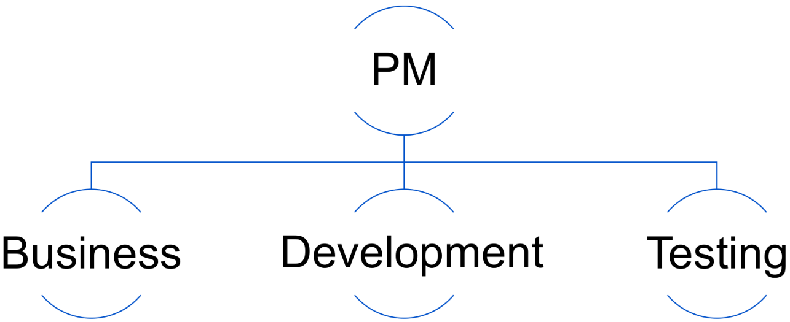
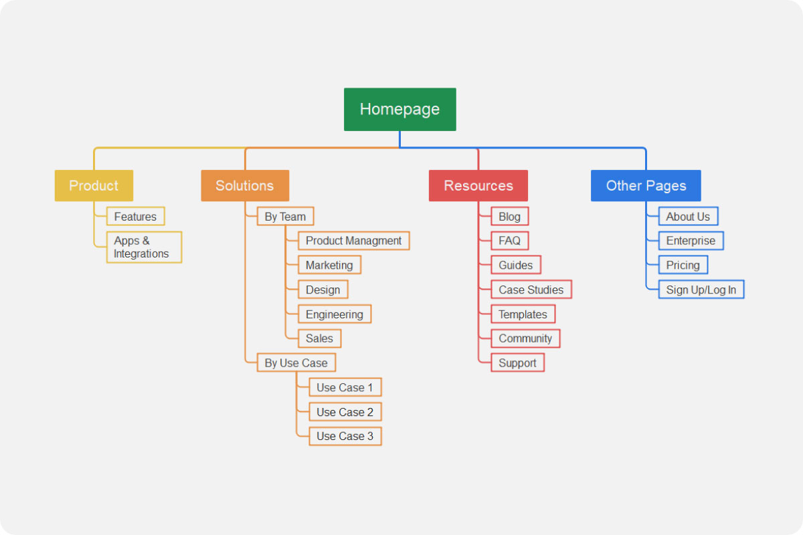
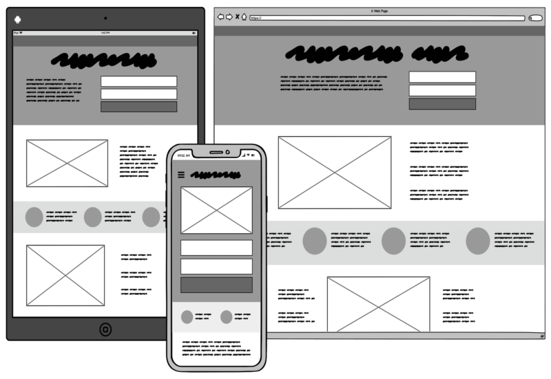
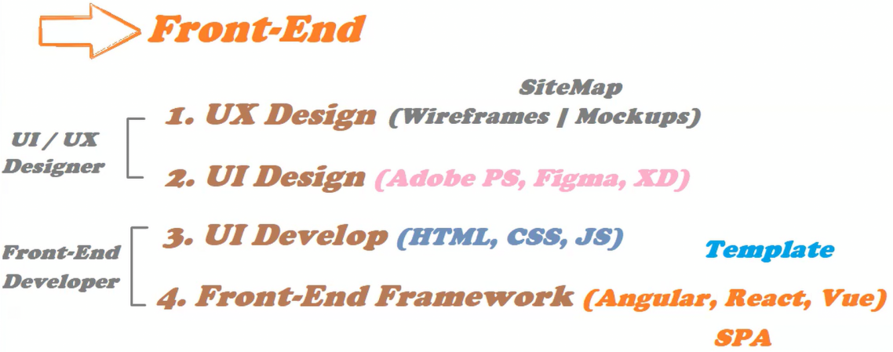
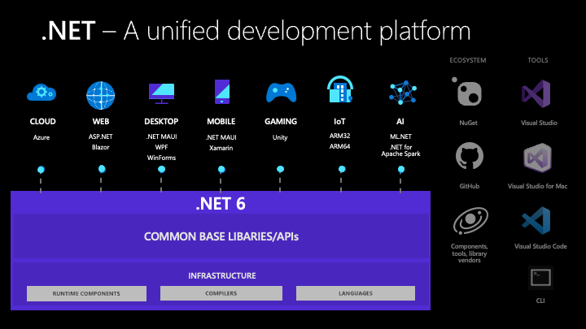
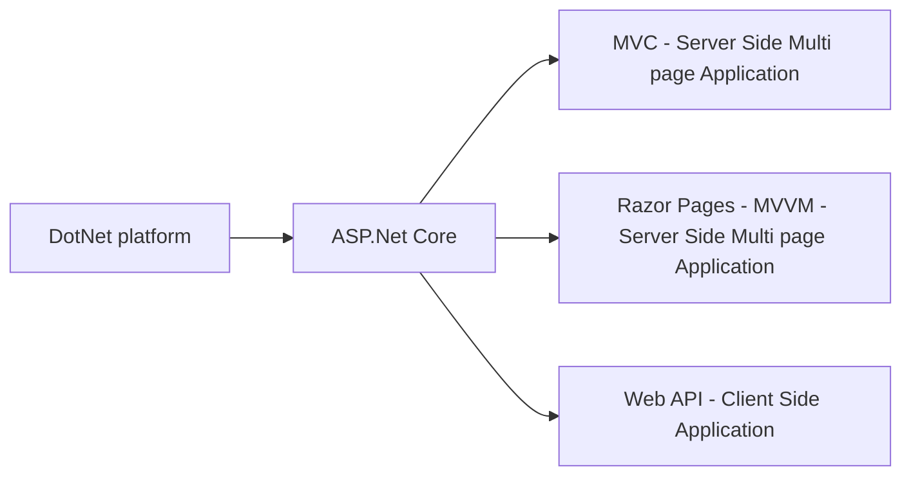

-  Server-side application VS Client-side application (Single Page Application - SPA)
-  How does frontend and backend communicate?
-  In analysis phase, the business team, PM, and sales team work together to gather requirements from the customer.
-  Who is the project manager, and what are the required teams?
   -  Business Team (Business Consultant) - Adds customer requirements into requirements document (SRS Software Requirement Specification)
   -  Development Team (Team Leader, Senior Developer, Junior Developer)
   -  Testing Team (QA)
-  Development Models
   -  Waterfall Model: each phase must be completed before the next phase begins
   -  Agile Model: iterative and incremental development. Delivering small modules of the project in short time frames.
-  In Development Phase (Design, Development)
   -  UX: Provide Site Map for website Navigation, Wireframe, Mockup, Prototype
   -  UI: Uses wireframe and mockup to design the website
   -  UI Development: Template Design, HTML, CSS, JavaScript (in case of Multi-Page Application)
   -  Choosing framework in case of SPA (Angular, React, Vue)
-  UI/UX Designer should have a basic understanding of HTML, CSS, and JavaScript, frontend developer should have a basic understanding of UI/UX, and backend developer should have a basic understanding of frontend.
-  Angular is best coupled with DotNet
-  Backend
   -  Programming
      -  Programming Paradigm
         -  Functional Programming
         -  Event-Driven Programming
         -  Object-Oriented Programming
   -  Database
-  **Review Syntax Sugar part**
-  [Source DotNet](https://source.dot.net/)
-  Review the last part of the session

---

# Session Record

## Video 1 (Web Application)

-  We connect to remote servers or devices via their IP (ex: remote desktop connection app on windows and ssh on linux)
-  HTTP request message
-  Server Side applications (Multi page web application)
-  Client Side applications (Single page web application)
-  In SPAs less number of requests are made to the server
-  Transpilation in SPAs is the process of converting JSX or TypeScript to JavaScript (???)
-  In Dynamic websites, We have a database which we get the content from
-  In server side applications backend developers get a template from frontend devs and converts it to a dynamic website that communicates with the database
-  Web applications can't use database directly they use an API
-  APIs are services and those services are actually functions that are implemented in one of the backend languages like C# or Java
-  To allow the frontend or mobile devs to use those functions we convert them into services (APIs)

## Video 2 (Web Application)

{width=600px}

1. Project Manager (PM): Defines business scope via meetings with customers, business scope is used to know the cost, time, and resources (team members) needed for the project
2. Team Consists of:
   1. Business team
   2. Development Team
   3. Testing Team
3. Business Team: Business Consultant/Analyst (sometimes mentioned to as product owner) is the person who gets the customer requirements and hands it to the development team. A business consultant should have good communication and presentation skills as he will make presentations to the customer about the finished parts of the project. He should also know when to say no for some of the customer requirements that can't be implemented and knows how to do that in a good way that doesn't look bad for the customer. The business consultant is the represnts the image of the company infront of the customer. After the customer tells the business team about his requirements he signs a document about these requirements and if he needs to change anything later he will sign a (CR change request) and will pay for the new requirements
   1. Business Consultant: Adds customer requirements into requirements document SRS Software Requirement Specification, an SRS per service/module
      1. SRS Software Requirement Specification = Requirement Specification Document RSD = Business Requirements Document BRD
      2. The SRS is shared with the development team and they can ask questions about it, if there is anything unclear.
      <!-- 2. Business Analyst: Analyzes the requirements and creates a document that is understandable by the development team -->
4. Development Team: they have a development manager (software architect). The team can be divided into (frontend, backend) or (frontend, backend, mobile if there)
   -  Development teams divisions like frontend or backend are also divided into multiple things like Juniors, Seniors, Specialists, and each team has a Technical lead. Dev Teams sub-teams depend on the project scale and when it should be finished
5. Testing team: testing team is divided into Quality Assurance (QA) and Quality Control (QC)
6. Back then we used a development model called Waterfall Model to develope projects in which we finish each development phase then we start the other, this model used to consume a lot of time and make development a lot slower. In that model the business analyst writes the customer needs in requirements document then design phase then development then deployment
7. Now we use Agile, in which each project is divided into a collection of services and modules, then we hand each module to the customer after a specified amount of time this is called a release and its defined by the project manager. Each release is divided into some iterations/sprints which would take from a week to a month. Each sprint has a sprint backlog which has the tasks that should be done. Jira is one of the Programs that is used in the agile model.
8. The first phase is the analysis phase in which the business consultant and product manager meet the customer to gather his requirements. The business consultant writes the customer requirements into SRS and the product manager defines business scope, type, cost, how many developers and testers needed. There is also one of the sales team who tries to sell the software to the customer and tries to make the customer buy the software or buy the software more features. The sales team meets the customer twice once in the analysis phase and the other in the final phase to show him the finished product.
9. Development and testing teams start working on the application at the same time in agile.

## Video 3 (Development Phase)

1. The frontend development team doesn't convert the application directly into a web application, they first need a design from the UX team. The UX team provides the site map for the website navigation, wireframe, mockup, and prototype. The UI team uses the wireframe and mockup to design the website, like the color, font, and the design of the website. The UI development team uses the design to create the website template using HTML, CSS, and JavaScript.
<!-- The UI/UX designer should have a basic understanding of HTML, CSS, and JavaScript. The frontend developer should have a basic understanding of UI/UX. The backend developer should have a basic understanding of frontend. -->

{width=450px}

{width=450px}

2. After the template is finished we decide if we want a multi-page application (server side application) or a single-page application (Client side application). If we want a multi-page application then the frontend team job is done and the backend team (DotNet in our case) will take the template and convert it into a dynamic website that communicates with the database using one of two technologies in DotNet (MVC or Razor Pages). If we want a single-page application then the frontend team will use a framework like Angular, React, or Vue to convert the template into a single-page application. That single page application will have static content, so to make the content dynamic, the backend team will need to create a web API that the frontend team will use to get the dynamic content from the database.
   1. The difference between Angular, and React or Vue is that Angular is a full featured framework that has everything you need and is supported by Google, so if you face any problem you can call Google for support. React and Vue are open source libraries, not full featured, and made by individuals not companies. So if you face any problem you will need to search for the solution on the internet, or open an issue on their GitHub page and wait for a response that you may get or not.
   2. Angular has a defined architecture, but react is more flexible.
   3. Angular has higher learning curve compared to React or Vue.
   4. Angular has larger life cycle compared to React or Vue.
   5. One of React problems as being a library not a framework that most of the libraries you will use are made by individuals, can be deprecated at any time, and have no support.

{width=450px}

> Since we are using agile, one of the main principles of agile is that team members should be cross-functional, so the UI/UX designer should have a basic understanding of HTML, CSS, and JavaScript. The frontend developer should have a basic understanding of UI/UX. The backend developer should have a basic understanding of frontend, and so on.
> Know everything about something, and know something about everything.
> Sometimes the frontend team has a little number of devs, so they may require the backend team to help them in the frontend, and the same for the backend team, **This happens sometimes.**

## Video 4 (What to do to work as a frontend or backend)

1. To work as a frontend developer you need to know HTML, CSS, and JavaScript. You also need to know a frontend framework like Angular, React, or Vue. But as an advice you should know all of them, because you may work in a company that uses Angular, and you know React, so you will need to learn Angular to work in that company. To also be a good frontend developer you may need to know how to build your own framework, so you can understand how the frameworks work.
   -  A frontend dev may have some knowledge about backend like using node.js, but it would be hard for him to know everything as frontend is a big field already.
2. To work as a backend you need to know either Java spring or C# DotNet. Most of the companies don't hire junior backend Node.js developers, so if you are a junior backend developer you may need to learn Java spring or C# DotNet to get a job.
   -  Best coupled frontend framework with DotNet is Angular. Most of the senior devs know Angular more than React because Angular appeared before React (Angular 1 appeared in 2010) and most of those people who learned Angular back then and started working are now senior devs.
   -  A fullstack dotnet developer is a backend developer who have some knowledge about frontend.
3. Backend is responsible for making the website dynamic
4. Dotnet Backend converts the template into a dynamic website using MVC or Razor Pages (in case of Multi-Page Application). In case of Single-Page Application, the backend team will need to create a web API that the frontend team will use to get the dynamic content from the database.
5. Backend is divided into two parts:
   1. Programming: Like converting the template into a dynamic website using MVC or Razor Pages
   2. Database: Like creating the web API that the frontend team will use to get the dynamic content from the database
6. DotNet can be used with different languages like C#, F#, and VB.NET. Before C# was also had J# (J from Java) which was a Java-like language but it wasn't continued because it was a copy of Java and Sun Microsystems (the company that owned Java at that time) sued Microsoft for that and Microsoft lost the case. So Microsoft stopped developing J# and started developing C#.
   1. C# was microsoft's own OOP language, and it was created by Anders Hejlsberg who also created TypeScript. C# was created in 2000 and was released in 2002.
   2. C# is more popular than all of other DotNet langs because it is more powerful and has more features than all of them, and more flexible as it can implement different paradigms like functional programming, event-driven programming, and object-oriented programming.
   3. In november of each year Microsoft releases a new version of C# with new features and improvements. In 2019 Microsoft released C# 7.3 at the beginning of the year, then in November of the same year they released C# 8.0. In 2020 they released C# 9.0, and in 2021 they released C# 10.0, and so on. Current latest version of C# is 12 which released in 2023.
   4. Example of the syntax improvements (syntax sugar) that comes with new versions of C# is the Date only and Time only types that were added in C# 10.0, before that we used to use DateTime type to store date and time, but now we can use Date only to store only the date, and Time only to store only the time. When that syntax sugar is compiled it will be converted into DateTime type, but it will be easier for the developer to use Date only and Time only types.
   5. In new versions microsoft also provides better performance.
   6. Another example is before C# 9.0 to print hello world we used to write this code:
      ```{.csharp .numberLines}
      namespace HelloWorld {
         class Program {
            static void Main(string[] args) {
               Console.WriteLine("Hello, World!");
            }
         }
      }
      ```
      But in C# 9.0 we can write it like this:
      ```{.csharp .numberLines}
      Console.WriteLine("Hello World");
      ```
7. We say a language supports functional programming if it has functions as first-class citizens, allows functions to be passed as arguments to other functions (callback function), and allows functions to return other functions, and allows functions to be assigned to variables, This means that these languages treat functions like data. Example of these languages are JavaScript which implements functional programming, and C#
   -  JS also has Object-Oriented Programming (OOP) but it's called prototype-based OOP
   -  JS also has Event-Driven Programming which is a programming paradigm in which the flow of the program is determined by events such as user actions (mouse clicks, key presses).
8. One of OOP principles is that any function should be defined inside a class, has an access modifier and a return type. In functional programming, you can define a function outside a class without an access modifier and a return type. Since C# supports both paradigms, you can define a function inside a class or outside a class as an anonymous function, you can also use other functional programming features without any problem.
9. OOP in C# will be discussed in like 5 sessions, and functional programming, event-driven programming, and other advanced topics will be discussed in also 5 sessions.
10.   backend needs to know about database and programming 1. programming is a language like C# and a framework like DotNet. What is framework? 2. What is dotnet platform? dotnet platform allows us to build different applications with different technologies, for example we can build a web application with dotnet core, a mobile application with xamarin, a desktop application with WPF, and a game with unity. Dotnet platform is a collection of libraries, tools, and languages that allows us to build different applications.
      {width=450px}
11.   From this image we know that we are not going to learn the whole DotNet platform but just ASP.NET for building web applications.
12.   We can't compare PHP with DotNet because PHP is a language and DotNet is a platform. We can compare PHP with ASP.NET (ASP = Active Server Pages)
13.   After 2014 Microsoft announced that they will make ASP.Net open source and cross-platform under the name ASP.Net _Core_, so we can build web applications with ASP.Net on Windows, Linux, and Mac, before that ASP.Net was only for Windows (Develope once, run everywhere). Also microsoft created a website to show the source code of DotNet, and it's called [source.dot.net](https://source.dot.net/). The first version of ASP.Net Core released in 2016, but Microsoft continued supporting ASP.Net Framework (the old closed source windows only version) until 2019, then they stopped supporting it and started supporting only ASP.Net Core, And in 2020 DotNet core was nearly finished and had most of the features that were in DotNet Framework, and at that time the old DotNet version was 4.8 so to avoid confusion they changed the name of DotNet Core to DotNet 5.0 the old versions of DotNet core before that were 1, 2, 3, and 4 was skipped.
14.   To start DotNet development, you need to download DotNet SDK (Software Development Kit).
15.   In ASP.Net core microsoft didn't add some features that were in ASP.Net Framework such as WebForms
16.   Odd versions of DotNet are supported for 1.5 years, and even versions are supported for 3 years. By saying support here we mean that if you face an issue and called Microsoft microsoft they will help you if you have a supported version and if not you should upgrade to a supported version first, also support means that Microsoft will release updates and patches for that version.
17.   To use new features of C# like C# 12 you need to use DotNet 8.0
18.   A lot of the old legacy code was written in ASP.Net Framework, which is refactored to ASP.Net Core. Also most developers prefer to use the even long-term supported versions of DotNet.

## What is ASP.Net Core?

To work in microsoft web development track, you should be able to develope server side applications using ASP.Net Core MVC or Razor pages, and provide a web service using Web API.



Razor pages are based on architecture pattern called MVVM (Model-View-ViewModel) which is a variation of MVC (Model-View-Controller) pattern.

MVC (Model View Controller) is more popular and has a better architecture

A URL like `www.netflix.com/movies/getMovie?name=avengers` is divided into 3 parts:

1. Host Name: `www.netflix.com` which is rented from a company called domain registrar. A host name refers to the IP of the server that hosts the website.
2. Path: `/movies/getMovie` which is the part of the website that the user wants to visit
3. Controller: `movies` which is a class that has methods that are called actions. Each action is a method that returns a view (They represent CRUD operations).
4. Action: `getMovie` which is a method that returns that movie from the database, inside the database we have a table called movies that has a for each property of the movie like name, description, and so on.
5. Models: They are classes that represent the tables in the database, each property in the model represents a column in the table.
6. Views: The returned object from the action is passed to the view which is an HTML file that displays the data from the model. The view is returned to the user as a response to the request.

We will study MVC in like 5 sessions, and will study Razor Pages in a session to know how to use the built-in security features module in DotNet. we will also learn how to implement the security module features from scratch in an MVC application.

---

The other framework that exists in DotNet platform is Blazor + Blazor Server which is used to build:

-  Real-time applications using SignalR which sends data from the server to the client without the client requesting it.
-  Blazor SPA using WebAssembly which is a technology that allows us to run C# code in the browser.

The browser only understands HTML, CSS, and JavaScript, so to run C# code in the browser we need to use something called dotnet runtime which loaded into the browser and it will convert the C# code into web assembly code that the browser can understand.

You should use SPA When you want to build a website with a lot of users and you want to reduce the number of requests made to the server.

There is multiple types of databases:

-  Relational Databases: like SQL Server, MySQL, Oracle, and PostgreSQL
-  Non-Relational Databases: like MongoDB
-  Cloud Databases: like Azure SQL, AWS RDS, and Google Cloud SQL
-  In-memory Databases: like Redis

## Testing Team

Testing team is divided into two parts:

-  QC (Quality Control): A team of testers who write tests for the project. They write test cases for each part of the project to make sure that it works as expected.
-  QA (Quality Assurance): Usually a person who assures that everything being worked on meets the standards and requirements of the project. He is responsible for the quality of the project. He asks questions about each and every part of the project to make sure that it meets the requirements of the customer. He monitors all the process and teams even the QC team, TL, and PM, and business consultant.

QA has a lower position than PM but he monitors the PM and the project.

QC writes test cases that are either manual or automated. Automated tests are written using a tool called Selenium. Test cases are either positive or negative tests.

QC + Dev Team work together on the SRS

## Agile

Agile teams use programs like Jira or Azure DevOps to manage the project. Azure devops is integrated with GitHub, it also has a log for tasks, bugs and issues, test cases.

Bugs are categorized into 3 types:

-  Critical: A severe bug that could lead to a big harm to the project
-  low
-  high

Project service stages:

-  Development
-  Testing
-  Staging
-  Production

Afte backend developes API, he deploys it to the dev server, then the frontend will start working on that API to build the frontend, then the frontend will deploy the frontend to the dev server, after everything is finished the project will be deployed to testing server, then the testing team will start testing the project (the developer may ask the testing team to send test cases to assure the project is working fine before deploying it to the testing server), if the testing team finds a bug they will send it to the dev team to fix it, then the dev team will fix it and deploy the project to the testing server again, and so on until the project is bug-free, then the project will be deployed to the staging server, then the business consultant will meet the customer to represent the project (this is the UAT user acceptance test stage) and if customer likes it the project will be deployed to the production server, and if the customer needs changes the changes will be categorized into CR (Change Request which is mostly not in original SRS) and the customer may need to sign a new document for the new requirements and pay for them, or just a UAT comment which is a small change that doesn't need a new document.

The steps above are repeated until the customer likes the project then we start deploying the project to the production server for release.

The first one who started talking about agile was Robert C. Martin (uncle Bob), he was a software engineer who worked in the software industry for more than 50 years. He was one of the people who wrote the [agile manifesto](https://agilemanifesto.org/principles.html) in 2001.

The person in the team who is certified in agile is called a scrum master, he is responsible for the agile process in the team. Mostly the scrum master is the PM. He is the agile coach in the team who helps the team to follow the agile process, and ensures that the team is following the agile process correctly.

Agile ensures that a project is delivered on time, on budget, with the required quality, and with the required features.

After each sprint in the project, the team will have a meeting called Retrospective meeting in which the team will discuss what went well in the sprint and what went wrong, and how to fix the wrong things in the next sprint. They also have a meeting called Sprint Planning meeting in which they plan the tasks that should be done in the next sprint.

Business consultant is sometimes called product owner

In some companies BC is different from the product owner. Also in some companies, PM is different from the scrum master.

There is a daily meeting called Standup meeting in which each team member will say what he did yesterday, what he will do today, and if he faced any problems.

## Route Course Rules

-  We have a standup meeting after 1 day of the session, its duration not more than 30 minutes.
-  You MUST join the standup meeting in time.
-  Each session will have an assignment at the end
-  You should submit the assignment after 48 hours of the session
-  You have extra 24 hours to submit the assignment after that the assignment will be considered as not submitted
-  You must join the workshop with mentor if:
   -  you didn't submit the assignment
   -  submitted the assignment with a lot of mistakes
   -  submitted the assignment in the extra 24 hours and the mentor will ask you a question at the end of the workshop, if you answered the question correctly you will be considered as submitted the assignment in time.
   -  Submitted the assignment but not completely
-  You will be blacklisted if:
   -  you didn't submit the assignment for 2 times in a row
   -  You submit the assignment 4 times in a row in the extra 24 hours you will be blacklisted
   -  You Cheat in the assignment
-  To get out of the blacklist you should submit the assignment in time for 4 times in a row
-  You have only 3 exceptions to not join the sessions and you should inform the instructor before the session starts.

Some Advices:

-  Always take notes
-  Always study old materials while progressing in the course
